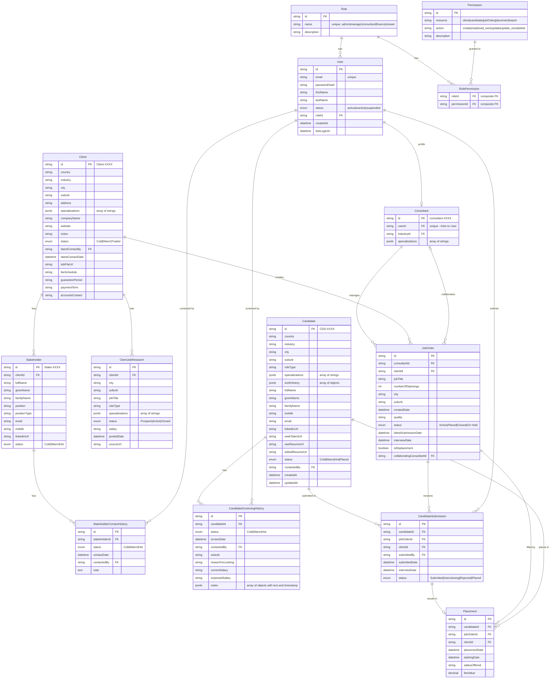

# Recruitment System Database ERD

## Entity Relationship Diagram

## Tables Summary

### User & RBAC Tables

| Table | Description | Primary Key |
|-------|-------------|-------------|
| **User** | System users (authentication & authorization) | userId |
| **Role** | User roles (admin, manager, consultant, finance, viewer) | roleId |
| **Permission** | Granular permissions (resource + action) | permissionId |
| **RolePermission** | Junction table linking roles to permissions | (roleId, permissionId) |

### Core Entities

| Table | Description | Primary Key | Row Count (from Excel) |
|-------|-------------|-------------|------------------------|
| **Consultant** | Recruiter profile (linked to User) | consultantId | ~14 |
| **Client** | Client companies (employers) | clientId | ~96 |
| **Candidate** | Job seekers in the database | candidateId | ~105 |
| **JobOrder** | Active job positions being filled | jobOrderId | ~64 |

### Relationship Tables

| Table | Description | Primary Key |
|-------|-------------|-------------|
| **Stakeholder** | Contacts at client companies | stakeholderId |
| **StakeholderContactHistory** | Communication history with stakeholders | contactHistoryId |
| **ClientJobResearch** | Job openings research/prospects | jobResearchId |
| **CandidateScreeningHistory** | Screening/call notes with candidates | screeningId |
| **CandidateSubmission** | Candidate submissions to job orders | submissionId |
| **Placement** | Successful placements | placementId |

### JSONB Fields (Flexible Arrays)

| Table | Field | Structure | Example |
|-------|-------|-----------|---------|
| **Candidate** | workHistory | `[{company, role, startDate, endDate}]` | `[{"company":"Google","role":"Engineer"}]` |
| **Candidate** | specializations | `["string"]` | `["Electrical","Commercial"]` |
| **Consultant** | specializations | `["string"]` | `["Manufacturing","Mining"]` |
| **Client** | specializations | `["string"]` | `["Industrial","Residential"]` |
| **ClientJobResearch** | specializations | `["string"]` | `["Commercial"]` |
| **CandidateScreeningHistory** | notes | `[{text, createdAt}]` | `[{"text":"Called...","createdAt":"2024-01-15"}]` |

## Key Relationships

### User & RBAC
1. **Role → User**: One-to-many (one role per user)
2. **Role → RolePermission → Permission**: Many-to-many (roles have multiple permissions)
3. **User → Consultant**: One-to-one (consultant is a profile for recruiter users)

### Business Entities
4. **Client → Stakeholder**: One-to-many (a client company has multiple contacts)
5. **Stakeholder → ContactHistory**: One-to-many (track all communications)
6. **Client → JobResearch**: One-to-many (research job openings at clients)
7. **Consultant → JobOrder**: One-to-many (consultants manage multiple jobs)
8. **Client → JobOrder**: One-to-many (clients have multiple open positions)
9. **Candidate → ScreeningHistory**: One-to-many (multiple screening calls)
10. **Candidate → CandidateSubmission**: One-to-many (submitted to multiple jobs)
11. **JobOrder → CandidateSubmission**: One-to-many (multiple candidates per job)
12. **CandidateSubmission → Placement**: One-to-one (successful submission = placement)

## Status Enums

### User Status
- `Active` - Can login and use system
- `Inactive` - Account disabled (e.g., left company)
- `Suspended` - Temporarily blocked

### Client Status
- `Cold` - No recent contact
- `Warm` - Recently engaged
- `Traded` - Has done business with us

### Candidate Status
- `Cold` - Not recently contacted
- `Warm` - Actively engaged
- `Hot` - Ready for placement
- `Placed` - Successfully placed

### JobOrder Status
- `Active` - Currently hiring
- `Placed` - Position filled
- `Closed` - No longer hiring
- `On Hold` - Temporarily paused

### Submission Status
- `Submitted` - Candidate submitted
- `Interviewing` - In interview process
- `Rejected` - Not selected
- `Placed` - Successfully placed

## RBAC (Role-Based Access Control)

### Roles

| Role | Description |
|------|-------------|
| `admin` | Full system access, manage users and settings |
| `manager` | View all data, reports, manage team |
| `consultant` | CRUD own clients/candidates/jobs |
| `finance` | View placements, fees, invoices |
| `viewer` | Read-only access |

### Permission Matrix

| Resource | Action | admin | manager | consultant | finance | viewer |
|----------|--------|:-----:|:-------:|:----------:|:-------:|:------:|
| **user** | create | ✓ | | | | |
| **user** | read | ✓ | ✓ | | | |
| **user** | update | ✓ | | | | |
| **user** | delete | ✓ | | | | |
| **client** | create | ✓ | ✓ | ✓ | | |
| **client** | read | ✓ | ✓ | | ✓ | ✓ |
| **client** | read_own | ✓ | ✓ | ✓ | ✓ | ✓ |
| **client** | update | ✓ | ✓ | | | |
| **client** | update_own | ✓ | ✓ | ✓ | | |
| **client** | delete | ✓ | | | | |
| **candidate** | create | ✓ | ✓ | ✓ | | |
| **candidate** | read | ✓ | ✓ | | | |
| **candidate** | read_own | ✓ | ✓ | ✓ | | |
| **candidate** | update_own | ✓ | ✓ | ✓ | | |
| **candidate** | delete | ✓ | | | | |
| **jobOrder** | create | ✓ | ✓ | ✓ | | |
| **jobOrder** | read | ✓ | ✓ | | ✓ | ✓ |
| **jobOrder** | read_own | ✓ | ✓ | ✓ | ✓ | ✓ |
| **jobOrder** | update_own | ✓ | ✓ | ✓ | | |
| **jobOrder** | delete | ✓ | | | | |
| **placement** | create | ✓ | ✓ | ✓ | | |
| **placement** | read | ✓ | ✓ | | ✓ | ✓ |
| **placement** | read_own | ✓ | ✓ | ✓ | ✓ | ✓ |
| **report** | read | ✓ | ✓ | | ✓ | |
| **report** | read_own | ✓ | ✓ | ✓ | | |

### Ownership

`read_own` and `update_own` permissions check if the resource belongs to the user:
- **Client**: `latestContactBy` = current user
- **Candidate**: `contactedBy` = current user
- **JobOrder**: `consultantId` = current user's consultant profile
- **Placement**: via JobOrder ownership

## Column Mapping from Excel

### Job Orders Portfolio.xlsx

#### Consultant Job Order → JobOrder + CandidateSubmission
| Excel Column | DB Field | Table |
|--------------|----------|-------|
| Consultant | consultantId | JobOrder |
| Company (Client ID lookup) | clientId | JobOrder |
| Job Title | jobTitle | JobOrder |
| Numbers of Openings | numberOfOpenings | JobOrder |
| City (lookup) | city | JobOrder |
| Suburb (lookup) | suburb | JobOrder |
| Job Created Date | createdDate | JobOrder |
| Quality | quality | JobOrder |
| Status (optional) | status | JobOrder |
| Candidate Submitted - CandidateID | candidateId | CandidateSubmission |
| Candidate Rejected | status='Rejected' | CandidateSubmission |
| Candidate Placed | candidateId | Placement |
| Placement Starting Date | startingDate | Placement |
| Salary Offered | salaryOffered | Placement |
| Fee Value | feeValue | Placement |
| If it is a replacement | isReplacement | JobOrder |
| If collaborated with another consultant | collaboratingConsultantId | JobOrder |
| Latest Submission Date | latestSubmissionDate | JobOrder |
| Interview Date | interviewDate | CandidateSubmission |

#### Manager Interface → Consultant
| Excel Column | DB Field |
|--------------|----------|
| consultantID | id |
| consultant | name |
| industry | industry |
| specialization_1 | specialization_1 |
| specialization_2 | specialization_2 |
| specialization_3 | specialization_3 |

### Icarus Client Database.xlsx

#### Client Company Info → Client
| Excel Column | DB Field |
|--------------|----------|
| ClientID (Primary Key) | id |
| Country | country |
| Industry | industry |
| City | city |
| Suburb | suburb |
| Addresses | address |
| Specialization_1/2/3 | specialization_1/2/3 |
| Company Name | companyName |
| Website | website |
| Notes | notes |
| Status | status |
| Latest Contact by | latestContactBy |
| Latest Contact Date | latestContactDate |
| TOB File Link | tobFileLink |
| Fee Schedule | feeSchedule |
| Guarantee Period | guaranteePeriod |
| Payment Term | paymentTerm |
| Client Accounts Contact | accountsContact |

#### Client Stakeholder Info → Stakeholder
| Excel Column | DB Field |
|--------------|----------|
| StakeholderID (Primary key) | id |
| ClientID(Foreign Key) | clientId |
| Full Name | fullName |
| Given Name | givenName |
| Family Name | familyName |
| Current position | position |
| Position type | positionType |
| email | email |
| mobile | mobile |
| linkedin URL | linkedinUrl |
| Stakeholder Status | status |

#### Stakeholder Contact History → StakeholderContactHistory
| Excel Column | DB Field |
|--------------|----------|
| StakeholderID (Foreign Key) | stakeholderId |
| Status | status |
| last contact date | lastContactDate |
| contacted by | contactedBy |
| contacted history | contactHistory |

#### Client Job Opening Research → ClientJobResearch
| Excel Column | DB Field |
|--------------|----------|
| ClientID | clientId |
| City | city |
| Suburbs | suburb |
| Job Title | jobTitle |
| Role Type | roleType |
| Specialization_1/2/3 | specialization_1/2/3 |
| Status | status |
| Salary | salary |
| posted date | postedDate |
| Permanent URL | permanentUrl |

### Icarus Candidate Database.xlsx

#### Candidate Basic Info → Candidate + CandidateWorkHistory
| Excel Column | DB Field | Table |
|--------------|----------|-------|
| CandidateID | id | Candidate |
| Country | country | Candidate |
| Industry | industry | Candidate |
| City | city | Candidate |
| Suburb | suburb | Candidate |
| Role Type | roleType | Candidate |
| Specialization_1/2/3 | specialization_1/2/3 | Candidate |
| Full Name | fullName | Candidate |
| Given Name | givenName | Candidate |
| Family Name | familyName | Candidate |
| Mobile | mobile | Candidate |
| Email | email | Candidate |
| Linkedln URL | linkedinUrl | Candidate |
| SeekTalentURL | seekTalentUrl | Candidate |
| Company_1/2/3 | company | CandidateWorkHistory |
| Role_1/2/3 | role | CandidateWorkHistory |
| Tenure_1/2/3 | tenure | CandidateWorkHistory |
| Raw Resume link | rawResumeLink | Candidate |
| Editted Resume Link | editedResumeLink | Candidate |
| Status | status | Candidate |
| Contacted by | contactedBy | Candidate |
| Updated Date | updatedDate | Candidate |

#### Candidate Screening History → CandidateScreeningHistory
| Excel Column | DB Field |
|--------------|----------|
| CandidateID(Lookup) | candidateId |
| Status | status |
| Last Contact Date | lastContactDate |
| contacted by | contactedBy |
| screen date | screenDate |
| Suburb | suburb |
| Reason of Looking Out | reasonForLooking |
| Current Salary | currentSalary |
| Expected Salary | expectedSalary |
| Notes1/2/3 | notes1/2/3 |

#### Job Interviewing History → CandidateSubmission + Placement
| Excel Column | DB Field | Table |
|--------------|----------|-------|
| CandidateID | candidateId | CandidateSubmission |
| Companies Submitted | clientId | CandidateSubmission |
| submitted date | submittedDate | CandidateSubmission |
| interview date | interviewDate | CandidateSubmission |
| Submitted by | submittedBy | CandidateSubmission |
| Companies Placed into | clientId | Placement |
| placement date | placementDate | Placement |
