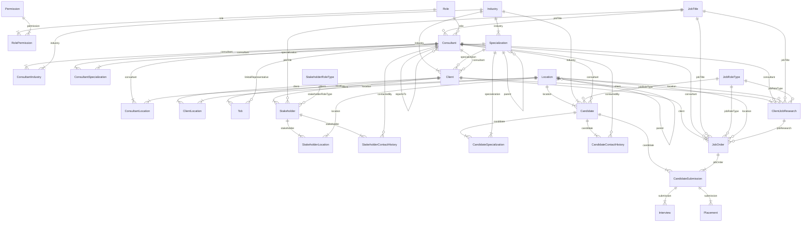

# Database ERD

Schema of record: `apps/api/prisma/schema.prisma`. This document explains the
*shape* — what each table is for, and the two ideas (the location tree and the
industry/specialization tree) that most of the design hangs off. Field-level
detail lives in the schema itself, which carries its own comments; duplicating
every column here only guarantees the copy goes stale.

Migrations: a single squashed `0_init` (see `docs/migrations.md`). The earlier
25-migration history was discarded when the database was rebuilt — nothing
depends on it.

---

## The two hierarchies

Almost every scoping and filtering decision in this system resolves through one
of two trees, and both work identically: **a node covers itself plus every
descendant.**

**Geography** — `Location`, four rungs, bulk-loaded from GeoNames:

```
Australia (COUNTRY) → New South Wales (STATE) → Sydney (CITY) → Silverwater 2128 (SUBURB)
```

Nothing in this table is hand-typed. `location:create` is admin-only, because
the scope resolver reads this tree and a drifted node silently changes who can
see what. Linktal's own desk labels are *not* nodes — `Brisbane GC QLD` is two
CITY grants (Brisbane, Gold Coast), `East Malaysia` is two STATE grants (Sabah,
Sarawak), `All Malaysia` is one COUNTRY grant.

**Taxonomy** — `Industry` → `Specialization` → child `Specialization`:

```
Manufacturing → Engineering Parts → Engineering Parts Fibre Optics
Manufacturing → Food             → Food Bakery
```

The source data already encoded this second tier in its naming; the `parentId`
self-relation is what makes it queryable. Consultants grant coarse categories
(`Food`); clients and candidates tag specific leaves (`Food Bakery`). Both
`industry:create` and `specialization:create` are admin+manager only, for the
same scope-bearing reason as Location.

### Single node vs. set of nodes

| Carries | Entities | Why |
|---|---|---|
| **One** most-specific node | `Candidate.locationId` (required), `JobOrder.locationId`, `ClientJobResearch.locationId` | a person or a job is in one place |
| **A set** of nodes, any level | `Client.locations`, `Stakeholder.coverage`, `Consultant.locations` | a hiring market, a coverage area, or a desk spans several |

Matching one against the other is just walking the single node up its parent
chain and testing for membership in the set — which is why mixed granularity on
either side costs nothing.

---

## Scoping

```
visible  =  (industry match AND specialization match)  OR  (location match)
```

Applies to the `consultant` role only; admin, manager, finance and researcher
are unrestricted. Full rules, wildcard handling and null semantics are in
`docs/rbac-roles.md` §3 — that file is the source of truth for authorization,
this one only notes which columns it reads.

---

## Job Title vs. Role Type

Two different facts about the same job, deliberately kept apart:

| | Who assigns it | Table | Example |
|---|---|---|---|
| **Job Title** | the company | `JobTitle` | "Product Engineer" |
| **Role Type** | the Linktal consultant | `JobRoleType` / `StakeholderRoleType` | "Software Engineer" |

Role types are split into two catalogs because the vocabularies never overlap:
`JobRoleType` classifies *jobs and people* (Electrician, Fitter Lead, CNC
Machinist) and is used by Candidate / JobOrder / ClientJobResearch;
`StakeholderRoleType` classifies *contacts* by function (HR, Finance, Safety,
Procurement) and is used by Stakeholder alone. Merging them would offer trades
in the dropdown when tagging a CFO.

All three catalogs are combobox-growable by any consultant — none of them
carries scoping weight, so free creation costs nothing and speeds data entry.

A Candidate has no `JobTitle`: their equivalent is `currentRole`, free text for
whatever their current employer calls them.

---

## Entity relationship diagram



---

## Tables

### RBAC & identity
| Table | Purpose |
|---|---|
| `Role` · `Permission` · `RolePermission` | the permission matrix (seeded — `prisma/seed.ts`) |
| `Consultant` | every system user: login identity, role, seniority (`jobTitleId`), `salary`, `costTo`, and `reportsToId` for the org chart. There is no separate User table |
| `ConsultantIndustry` · `ConsultantSpecialization` · `ConsultantLocation` | the visibility grants — explicit join models, not implicit m2m, so each grant is written as its own audited create/delete |

### Reference catalogs
| Table | Created by | Scope-bearing |
|---|---|---|
| `Location` | admin only (GeoNames) | yes |
| `Industry` · `Specialization` | admin + manager | yes |
| `JobTitle` · `JobRoleType` · `StakeholderRoleType` | anyone (combobox) | no |

### Client side
| Table | Purpose |
|---|---|
| `Client` | the hiring company. `industryId` required, `specializationId` optional, hiring market via `ClientLocation` |
| `ClientLocation` | m2m — where this client hires from |
| `Tob` | Terms of Business, many per client. Everything but `clientId` optional; `pricing` is free text ("13%-(80k below)15%-18%"), `guaranteePeriod` numeric days |
| `Stakeholder` | a contact at a client. Both `jobTitleId` and `stakeholderRoleTypeId`; coverage via `StakeholderLocation` |
| `StakeholderLocation` | m2m — the territory this contact covers, matched on its own, independent of where the client sits |
| `StakeholderContactHistory` | one logged touch. `category` separates "Detailed Brief Notes" from "Outreach Campaign History"; `contactType` is the channel |
| `ClientJobResearch` | a job ad found in the market (Seek/LinkedIn) — public information, unrelated to whether Linktal has been briefed. Optionally linked from a `JobOrder` |

### Candidate side
| Table | Purpose |
|---|---|
| `Candidate` | `locationId` and `industryId` required, everything else optional. `jobRoleTypeId` for classification, `currentRole`/`currentCompany` free text, `workHistory` JSONB |
| `CandidateSpecialization` | m2m — a candidate can carry several |
| `CandidateContactHistory` | screening notes *and* outreach notes, separated by `category`. `currentSalary`/`expectedSalary` are free text — the source records them as "35 per hour", "more 53-55" |

### Pipeline
| Table | Purpose |
|---|---|
| `JobOrder` | a position Linktal has been briefed on. Both `jobTitleId` and `jobRoleTypeId` |
| `CandidateSubmission` | one candidate put forward to one job order (unique pair) |
| `Interview` | rounds within a submission — `roundLabel` free text, not an enum |
| `Placement` | a successful hire, with the fee calculation |
| `AuditLog` | append-only record of every write and its actor |

---

## displayId

Every entity carries a human-readable `displayId`, generated by a per-table
Postgres sequence (`ALTER SEQUENCE ... OWNED BY` in `0_init`, so it drops with
its table):

| | | | |
|---|---|---|---|
| `consultant-####` | `Client-####` | `Stake-####` | `CDD-####` |
| `TOB-####` | `CN-####` | `CDN-####` | `JR-####` |
| `JO-####` | `SUB-####` | `INT-####` | `PLC-####` |

These double as the **import identity**. The source workbook's own ID columns
are entirely empty and its cross-sheet links are written as name + spreadsheet
row number, so the importer assigns `displayId` deterministically from row
position and re-imports match on it. Natural keys can't do this job: 744
candidate rows share an email with another row, 568 share a mobile, and 31 have
neither — keying on email would silently merge distinct people.

Consequence: rows must not be re-sorted in the source workbook between imports.
Appending is safe. Writing the assigned `displayId`s back into the workbook's ID
columns removes that constraint permanently.

---

## JSONB fields

| Field | Shape |
|---|---|
| `Candidate.workHistory` | `[{company, role, period}]` — `period` is free text ("2020 – 2021 (1 year)"); the source never stores parseable dates |
| `Candidate.notes` | `[{id, content, timestamp, by, editedAt, editedBy}]` — edit/delete restricted to the note's author or an admin |
| `Client.addresses` · `Client.suburbsAndPostcodes` | arrays of strings — the client's own offices, distinct from its hiring market |

`Client` has no notes timeline; client-side notes live in
`StakeholderContactHistory`.

---

## Denormalized `lastContactedAt` / `lastContactedById`

Present on `Client`, `Stakeholder` and `Candidate`. These are real columns, not
computed: Prisma's relation-aggregate `orderBy` supports only `_count`, not
`_max`, so sorting a list by "most recently contacted" needs a column. Source of
truth remains the contact-history tables; the columns are advanced on write, and
only when the incoming contact is newer than what's stored (a backdated entry
must not clobber a more recent one).

The rest of the "latest contact" detail (channel, notes, who) is resolved live
from the top-1 history row — it's display-only and never sorted or filtered on.

---

## Status enums

| Enum | Values |
|---|---|
| `ClientStatus` | COLD · WARM · TRADED |
| `CandidateStatus` | COLD · WARM · PLACED · UNS |
| `JobOrderStatus` | ACTIVE · PLACED · CLOSED · ON_HOLD |
| `SubmissionStatus` | SUBMITTED · INTERVIEWING · REJECTED · PLACED |
| `InterviewOutcome` | SCHEDULED · PENDING · PASSED · FAILED · CANCELLED |
| `PlacementStatus` | ACTIVE · COMPLETED · FAILED |
| `PlacementFeeType` | PERCENTAGE · FLAT |
| `ClientQuality` · `JobOrderQuality` | LOW · MEDIUM · HIGH |
| `LocationLevel` | COUNTRY · STATE · CITY · SUBURB |

**Declaration order is sort order.** Postgres native enums sort by ordinal, not
alphabetically, so `ORDER BY quality` yields LOW < MEDIUM < HIGH and
`ORDER BY status` puts Active job orders first — no CASE expression needed.
`CandidateStatus.UNS` ("unsuitable") sits last deliberately: it's a dead end,
not a warmer stage than PLACED.

Source values that don't map 1:1 are translated on import — job order `Warm` →
`ACTIVE`, `Hold` → `ON_HOLD`. `CandidateStatus.HOT` was dropped; it appears
nowhere in the data.

---

## Placement fee calculation

```
Base Salary × (1 + Super%)  = Total Package
Total Package × Fee%        = Placement Fee     (feeType PERCENTAGE)
                            … or a flat feeValue (feeType FLAT)
```

`guaranteeEndDate` is **entered manually**. It used to be derived from
`Client.guaranteePeriod`, but guarantee terms now live per-`Tob` and a client can
hold several that disagree — picking the applicable one automatically would be
guesswork.

---

## Soft delete & audit

Soft-deleted models carry `deletedAt` / `deletedById`; the extended Prisma client
(`src/prisma/prisma.extensions.ts`) rewrites reads to exclude them and turns
`delete` into an update. Every write on an audited model lands in `AuditLog` with
its actor, action and a field-level diff.

Two consequences worth knowing:

- **Nested relation writes aren't diffable.** The extension sees top-level calls,
  which is why the grant joins are explicit models written one row at a time.
- **`CandidateSubmission`'s unique `(candidateId, jobOrderId)` is not partial** —
  a soft-deleted row still holds the pair, so re-submitting must restore the dead
  row rather than insert a new one.
