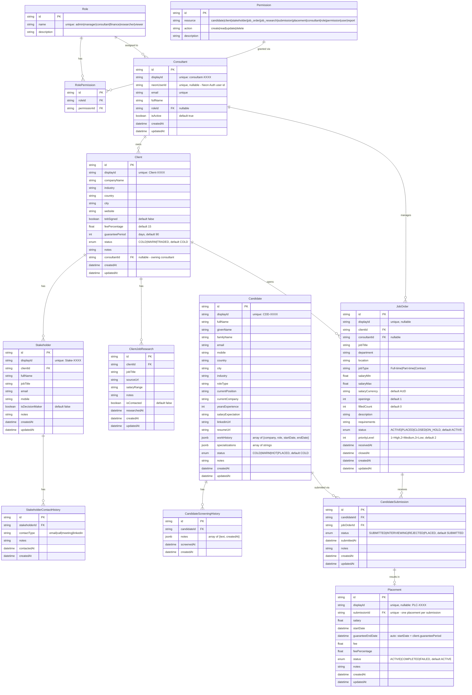

# Recruitment System Database ERD

> **Source of truth:** `apps/api/prisma/schema.prisma`. This document is kept in
> sync with that schema and the RBAC seed (`apps/api/prisma/seed.ts`). If they
> disagree, the schema wins — update this doc.

## Entity Relationship Diagram

## Tables Summary

### RBAC (roles attach to Consultant; no separate User table)

| Table | Description | ID |
|-------|-------------|----|
| **Role** | Named roles (admin, manager, consultant, finance, researcher, viewer) | cuid |
| **Permission** | `resource` + `action` pair | cuid, unique(resource, action) |
| **RolePermission** | Join: roles ↔ permissions | cuid, unique(roleId, permissionId) |
| **Consultant** | Local identity + role (linked to Neon Auth via `neonUserId`) | cuid, displayId `consultant-XXXX` |

### Core Entities

| Table | Description | Display ID |
|-------|-------------|------------|
| **Client** | Client companies (employers) | `Client-XXXX` |
| **Stakeholder** | Contacts at client companies | `Stake-XXXX` |
| **StakeholderContactHistory** | Communications with stakeholders | — |
| **ClientJobResearch** | Job-opening research / prospecting | — |
| **Candidate** | Job seekers (`workHistory`/`specializations` as JSONB) | `CDD-XXXX` |
| **CandidateScreeningHistory** | Screening notes (`notes` as JSONB) | — |
| **JobOrder** | Open positions | optional custom |
| **CandidateSubmission** | Candidate → JobOrder submissions | unique(candidateId, jobOrderId) |
| **Placement** | Successful placements (fee/guarantee) | `PLC-XXXX` |

### JSONB Fields

| Table | Field | Structure |
|-------|-------|-----------|
| **Candidate** | `workHistory` | `[{ company, role, startDate, endDate }]` |
| **Candidate** | `specializations` | `["string"]` |
| **CandidateScreeningHistory** | `notes` | `[{ text, createdAt }]` |

## Status Enums

| Enum | Values |
|------|--------|
| **ClientStatus** | `COLD` · `WARM` · `TRADED` |
| **CandidateStatus** | `COLD` · `WARM` · `HOT` · `PLACED` |
| **JobOrderStatus** | `ACTIVE` · `PLACED` · `CLOSED` · `ON_HOLD` |
| **SubmissionStatus** | `SUBMITTED` · `INTERVIEWING` · `REJECTED` · `PLACED` |
| **PlacementStatus** | `ACTIVE` · `COMPLETED` · `FAILED` |
| **UserStatus** *(enum defined, not yet used by a model)* | `ACTIVE` · `INACTIVE` · `SUSPENDED` |

## RBAC

Roles and permissions are created by `apps/api/prisma/seed.ts`. Access is
**role + resource + action** — there is **no row-level / "own" scoping**; a
permission like `candidate:read` grants read on all candidates. Enforcement:
`@RequirePermission(resource, action)` on controllers → `PermissionsGuard`.

### Resources & actions (seed)

- **Resources:** `candidate`, `client`, `stakeholder`, `job_order`,
  `job_research`, `submission`, `placement`, `consultant`, `role`, `permission`,
  `user`, `report`
- **Actions:** `create`, `read`, `update`, `delete`

### Role → permission matrix (from seed)

| Role | Grants |
|------|--------|
| **admin** | All actions on all resources |
| **manager** | `read` on all; `create`/`update` on candidate, client, stakeholder, job_order, job_research, submission, placement, consultant; `create` on report |
| **consultant** | Full CRUD on candidate, client, stakeholder, job_order, job_research, submission, placement; `read` on consultant, user, role, permission |
| **finance** | `read` on placement, client, job_order; `create`/`read` on report |
| **researcher** | `create`/`read`/`update` on client, stakeholder, job_research, candidate; `read` on job_order, submission, placement |
| **viewer** | `read` on candidate, client, stakeholder, job_order, job_research, submission, placement |

> New users are provisioned just-in-time on first login with the **viewer** role
> (`RbacService`). An imported consultant matched by email is backfilled with the
> **consultant** role.

## Key Relationships

1. **Role → Consultant** — one role per consultant (nullable).
2. **Role ↔ Permission** (via RolePermission) — many-to-many.
3. **Consultant → Client / JobOrder** — a consultant owns clients and manages job orders (`consultantId`, nullable).
4. **Client → Stakeholder → ContactHistory** — contacts and their communications.
5. **Client → ClientJobResearch** — prospecting research.
6. **Client → JobOrder** — open positions.
7. **Candidate → ScreeningHistory** — screening notes.
8. **Candidate → CandidateSubmission ← JobOrder** — submissions (unique per candidate+job).
9. **CandidateSubmission → Placement** — one placement per successful submission.

## Excel Import

Historical data is loaded from the Excel workbooks in `apps/api/data/` by the
scripts in `apps/api/scripts/`. **Those scripts are the authoritative
Excel→schema column mapping** (kept here previously, but they drift — read the
code instead):

| Script | Loads |
|--------|-------|
| `import:excel` | Candidates, Clients, Job Orders |
| `import:placements` | Submissions + Placements |
| `inspect:excel` | Prints sheet/column structure (no writes) |

See `apps/api/data/README.md` for setup. Run `seed` (RBAC) before importing.
