# Recruitment System Database ERD

> **Source of truth:** `apps/api/prisma/schema.prisma`. This document is kept in
> sync with that schema and the RBAC seed (`apps/api/prisma/seed.ts`). If they
> disagree, the schema wins — update this doc.

## Entity Relationship Diagram

```mermaid
erDiagram
    %% ==================== RBAC DOMAIN ====================
    Role {
        string id PK
        string name "unique: admin|manager|consultant|finance|researcher|viewer"
        string description
    }

    Permission {
        string id PK
        string resource "candidate|client|stakeholder|job_order|job_research|submission|placement|consultant|role|permission|industry|specialization|stakeholder_role_type|candidate_role_type|saved_search|report|audit"
        string action "create|read|update|delete"
        string description
    }

    RolePermission {
        string id PK
        string roleId FK
        string permissionId FK
    }

    %% ==================== IDENTITY / CONSULTANT ====================
    %% There is no separate User table. Authentication is handled by NextAuth
    %% (Auth.js) + Microsoft Entra ID (Azure AD), external; Consultant is the
    %% local identity + role record, linked by azureId. A first-time login is
    %% provisioned just-in-time (viewer role).
    Consultant {
        string id PK
        string displayId "unique: consultant-XXXX"
        string azureId "unique, nullable - Azure AD object id (oid)"
        string email "unique"
        string fullName
        string roleId FK "nullable"
        boolean isActive "default true"
        datetime createdAt
        datetime updatedAt
    }

    %% ==================== CLIENT DOMAIN ====================
    %% Industry/Specialization/StakeholderRoleType are reference tables (a
    %% fixed row instead of free text), so values stay consistent and
    %% reusable. No admin management page: the relevant form's combobox
    %% doubles as the catalog editor (pick existing, or type new to create
    %% one). See rbac-roles.md §4 for the create+read-only permission shape
    %% they share.
    Industry {
        string id PK
        string name "unique"
        boolean isActive "default true"
        datetime createdAt
        datetime updatedAt
    }

    Specialization {
        string id PK
        string name "unique"
        boolean isActive "default true"
        datetime createdAt
        datetime updatedAt
    }

    StakeholderRoleType {
        string id PK
        string name "unique - Director|Hiring Manager|HR|Talent Acquisition|Operations|Finance|Department Head|Other, growable"
        boolean isActive "default true"
        datetime createdAt
        datetime updatedAt
    }

    Client {
        string id PK
        string displayId "unique: Client-XXXX"
        string companyName
        string industryId FK "nullable"
        string specializationId FK "nullable"
        string country
        string city
        string website
        boolean tobSigned "default false"
        float feePercentage "default 15"
        int guaranteePeriod "days, default 90"
        enum status "COLD|WARM|TRADED, default COLD"
        enum quality "LOW|MEDIUM|HIGH, default MEDIUM - recruiter's read on prospect quality"
        jsonb notes "array of {id, content, timestamp, by, editedAt, editedBy}"
        datetime lastContactedAt "nullable, denormalized - max(contactedAt) across this client's stakeholders"
        string consultantId FK "nullable - owning consultant"
        datetime createdAt
        datetime updatedAt
    }

    Stakeholder {
        string id PK
        string displayId "unique: Stake-XXXX"
        string clientId FK
        string fullName
        string jobTitle
        string roleTypeId FK "nullable - derived from jobTitle by keyword match, independently editable"
        string email
        string mobile
        boolean isDecisionMaker "default false"
        string notes
        datetime lastContactedAt "nullable, denormalized - max(contactedAt) across this stakeholder's own history"
        datetime createdAt
        datetime updatedAt
    }

    StakeholderContactHistory {
        string id PK
        string stakeholderId FK
        string contactType "call|email|meeting|linkedin"
        string contactedById FK "nullable - consultant who made this specific contact"
        string notes
        datetime contactedAt "default now"
        datetime createdAt
    }

    ClientJobResearch {
        string id PK
        string clientId FK
        string jobTitle
        string sourceUrl
        string salaryRange
        string notes
        boolean isContacted "default false"
        datetime researchedAt
        datetime createdAt
        datetime updatedAt
    }

    %% ==================== CANDIDATE DOMAIN ====================
    %% CandidateRoleType is the same reference-table pattern as
    %% StakeholderRoleType above, but its own catalog — a candidate's role
    %% type is an employment category (Permanent/Contract/...), not
    %% StakeholderRoleType's functional/department classification.
    %% Industry/Specialization are shared with the Client domain (same
    %% catalog, e.g. one org-wide Industry list). Specialization is
    %% many-to-many for Candidate (unlike Client's single FK) via the
    %% CandidateSpecialization join, since a candidate can carry several.
    CandidateRoleType {
        string id PK
        string name "unique - employment type, e.g. Permanent|Contract|Temp, growable"
        boolean isActive "default true"
        datetime createdAt
        datetime updatedAt
    }

    Candidate {
        string id PK
        string displayId "unique: CDD-XXXX"
        string fullName
        string givenName
        string familyName
        string email
        string mobile
        string country
        string city
        string industryId FK "nullable"
        string roleTypeId FK "nullable"
        string currentPosition
        string currentCompany
        int yearsExperience
        string salaryExpectation
        string linkedinUrl
        string resumeUrl
        jsonb workHistory "array of {company, role, startDate, endDate}"
        jsonb skills "array of strings - free-entry tags, distinct from specializations (a shared reference-table taxonomy)"
        enum status "COLD|WARM|HOT|PLACED, default COLD"
        jsonb notes "array of {id, content, timestamp, by, editedAt, editedBy} - mirrors Client.notes"
        string consultantId FK "nullable - owning consultant, same shape as Client.consultantId"
        datetime lastContactedAt "nullable, denormalized - max(CandidateContactHistory.contactedAt)"
        datetime createdAt
        datetime updatedAt
    }

    %% Join table: a candidate can carry several specializations (unlike
    %% Client's single specializationId). No id/timestamps — pure join.
    CandidateSpecialization {
        string candidateId PK "also FK -> Candidate"
        string specializationId PK "also FK -> Specialization"
    }

    CandidateScreeningHistory {
        string id PK
        string candidateId FK
        jsonb notes "array of {text, createdAt}"
        datetime screenedAt
        datetime createdAt
    }

    %% A consultant's saved candidate search — personal, not shared. `filters`
    %% is opaque JSON (same shape as GET /candidates' query params) rather
    %% than individual columns, since it's only ever fetched whole by owner.
    CandidateSavedSearch {
        string id PK
        string name
        string consultantId FK
        jsonb filters "serialized filter state, same shape as GET /candidates query params"
        datetime createdAt
        datetime updatedAt
    }

    %% Mirrors StakeholderContactHistory exactly. Kept separate from
    %% CandidateScreeningHistory on purpose: a quick call/email/LinkedIn
    %% touch isn't the same event as a formal screening pass.
    CandidateContactHistory {
        string id PK
        string candidateId FK
        string contactType "call|email|meeting|linkedin"
        string contactedById FK "nullable - consultant who made this specific contact"
        string notes
        datetime contactedAt "default now"
        datetime createdAt
    }

    %% ==================== JOB ORDER DOMAIN ====================
    JobOrder {
        string id PK
        string displayId "unique, nullable"
        string clientId FK
        string consultantId FK "nullable"
        string jobTitle
        string department
        string location
        string jobType "Full-time|Part-time|Contract"
        float salaryMin
        float salaryMax
        string salaryCurrency "default AUD"
        int openings "default 1"
        int filledCount "default 0"
        string description
        string requirements
        enum status "ACTIVE|PLACED|CLOSED|ON_HOLD, default ACTIVE"
        int priorityLevel "1=High,2=Medium,3=Low; default 2"
        datetime receivedAt
        datetime closedAt
        datetime createdAt
        datetime updatedAt
    }

    %% ==================== SUBMISSION / PLACEMENT DOMAIN ====================
    CandidateSubmission {
        string id PK
        string candidateId FK
        string jobOrderId FK
        enum status "SUBMITTED|INTERVIEWING|REJECTED|PLACED, default SUBMITTED"
        datetime submittedAt
        string notes
        datetime createdAt
        datetime updatedAt
    }

    Placement {
        string id PK
        string displayId "unique, nullable: PLC-XXXX"
        string submissionId FK "unique - one placement per submission"
        float salary
        datetime startDate
        datetime guaranteeEndDate "auto: startDate + client.guaranteePeriod"
        float fee
        float feePercentage
        enum status "ACTIVE|COMPLETED|FAILED, default ACTIVE"
        string notes
        datetime createdAt
        datetime updatedAt
    }

    %% ==================== AUDIT / HISTORY DOMAIN ====================
    %% Not a domain table a user creates directly — every write to a model in
    %% AUDITED_MODELS (see below) produces one of these automatically via a
    %% Prisma Client Extension. No FK to actorId/entityId on purpose: it must
    %% keep a row even after the actor or the entity itself is gone.
    AuditLog {
        string id PK
        string actorId "logical ref to Consultant.id, nullable = system/import"
        string action "CREATE|UPDATE|SOFT_DELETE|RESTORE|HARD_DELETE|DEACTIVATE"
        string entityType "e.g. Candidate, Client, CandidateSubmission"
        string entityId "logical ref, no FK"
        jsonb changes "nullable: {field: {from, to}} for updates; created row for creates"
        jsonb metadata "nullable: {requestId?, ip?, cascade?, source: 'app'}"
        datetime createdAt
    }

    %% ==================== RELATIONSHIPS ====================
    Role ||--o{ RolePermission : "has"
    Permission ||--o{ RolePermission : "granted via"
    Role ||--o{ Consultant : "assigned to"

    Consultant ||--o{ Client : "owns"
    Consultant ||--o{ JobOrder : "manages"
    Consultant ||--o{ Candidate : "owns"
    Consultant ||--o{ StakeholderContactHistory : "made"
    Consultant ||--o{ CandidateContactHistory : "made"
    Consultant ||--o{ CandidateSavedSearch : "owns"

    Industry ||--o{ Client : "categorizes"
    Specialization ||--o{ Client : "categorizes"
    StakeholderRoleType ||--o{ Stakeholder : "categorizes"
    Industry ||--o{ Candidate : "categorizes"
    CandidateRoleType ||--o{ Candidate : "categorizes"
    Candidate ||--o{ CandidateSpecialization : "has"
    Specialization ||--o{ CandidateSpecialization : "categorizes"

    Client ||--o{ Stakeholder : "has"
    Stakeholder ||--o{ StakeholderContactHistory : "has"
    Client ||--o{ ClientJobResearch : "has"
    Client ||--o{ JobOrder : "opens"

    Candidate ||--o{ CandidateScreeningHistory : "has"
    Candidate ||--o{ CandidateContactHistory : "has"
    Candidate ||--o{ CandidateSubmission : "submitted via"
    JobOrder ||--o{ CandidateSubmission : "receives"
    CandidateSubmission ||--o| Placement : "results in"
```

## Tables Summary

### RBAC (roles attach to Consultant; no separate User table)

| Table | Description | ID |
|-------|-------------|----|
| **Role** | Named roles (admin, manager, consultant, finance, researcher, viewer) | cuid |
| **Permission** | `resource` + `action` pair | cuid, unique(resource, action) |
| **RolePermission** | Join: roles ↔ permissions | cuid, unique(roleId, permissionId) |
| **Consultant** | Local identity + role (linked to Azure AD via `azureId`) | cuid, displayId `consultant-XXXX` |

### Core Entities

| Table | Description | Display ID |
|-------|-------------|------------|
| **Client** | Client companies (employers) | `Client-XXXX` |
| **Industry** | Reference table for `Client.industryId` — growable via combobox | — |
| **Specialization** | Reference table for `Client.specializationId` — growable via combobox | — |
| **Stakeholder** | Contacts at client companies | `Stake-XXXX` |
| **StakeholderRoleType** | Reference table for `Stakeholder.roleTypeId` — seeded (Director, Hiring Manager, HR, Talent Acquisition, Operations, Finance, Department Head, Other), auto-derived from `jobTitle` by keyword match, growable via combobox | — |
| **StakeholderContactHistory** | Communications with stakeholders (`contactedById` attributes to a consultant) | — |
| **ClientJobResearch** | Job-opening research / prospecting | — |
| **CandidateRoleType** | Reference table for `Candidate.roleTypeId` — own catalog (employment type: Permanent/Contract/...), distinct from `StakeholderRoleType`, growable via combobox | — |
| **Candidate** | Job seekers (`workHistory`/`skills` as JSONB; `industryId`/`roleTypeId` FKs; specializations many-to-many via `CandidateSpecialization`) | `CDD-XXXX` |
| **CandidateSpecialization** | Join: candidates ↔ specializations (many-to-many — a candidate can carry several, unlike Client's single FK) | composite PK(candidateId, specializationId) |
| **CandidateScreeningHistory** | Screening notes (`notes` as JSONB) | — |
| **CandidateContactHistory** | Communications with candidates (mirrors `StakeholderContactHistory`) | — |
| **CandidateSavedSearch** | A consultant's saved candidate search (personal, `filters` as opaque JSON) | — |
| **JobOrder** | Open positions | optional custom |
| **CandidateSubmission** | Candidate → JobOrder submissions | unique(candidateId, jobOrderId) |
| **Placement** | Successful placements (fee/guarantee) | `PLC-XXXX` |
| **AuditLog** | Append-only history of every write to an audited model — see [Audit & History Tracking](#audit--history-tracking) | — |

### JSONB Fields

| Table | Field | Structure |
|-------|-------|-----------|
| **Candidate** | `workHistory` | `[{ company, role, startDate, endDate }]` |
| **Candidate** | `skills` | `["string"]` — free-entry tags, distinct from specializations (a shared, reference-table taxonomy) |
| **Candidate** | `notes` | `[{ content, timestamp, by }]` — internal note timeline, mirrors `Client.notes` |
| **CandidateScreeningHistory** | `notes` | `[{ text, createdAt }]` |
| **CandidateSavedSearch** | `filters` | serialized filter state, same shape as `GET /candidates`' query params |
| **Client** | `notes` | `[{ id, content, timestamp, by, editedAt, editedBy }]` — internal note timeline, newest last |
| **Candidate** | `notes` | `[{ id, content, timestamp, by, editedAt, editedBy }]` — identical shape to `Client.notes`; only the note's author or an admin may edit/delete it |
| **AuditLog** | `changes` | `{ field: { from, to } }` per changed field (updates); the full created row (creates) |
| **AuditLog** | `metadata` | `{ requestId?, ip?, cascade?, source: 'app' }` |

## Status Enums

| Enum | Values |
|------|--------|
| **ClientStatus** | `COLD` · `WARM` · `TRADED` |
| **ClientQuality** | `LOW` · `MEDIUM` (default) · `HIGH` — declared in this order so the native Postgres enum sorts ordinally, not alphabetically |
| **CandidateStatus** | `COLD` · `WARM` · `HOT` · `PLACED` |
| **JobOrderStatus** | `ACTIVE` · `PLACED` · `CLOSED` · `ON_HOLD` |
| **SubmissionStatus** | `SUBMITTED` · `INTERVIEWING` · `REJECTED` · `PLACED` |
| **PlacementStatus** | `ACTIVE` · `COMPLETED` · `FAILED` |
| **UserStatus** *(enum defined, not yet used by a model)* | `ACTIVE` · `INACTIVE` · `SUSPENDED` |

## RBAC

Roles and permissions are created by `apps/api/prisma/seed.ts`. Access is
**role + resource + action** — there is **no row-level / "own" scoping**; a
permission like `candidate:read` grants read on all candidates. Enforcement:
`@RequirePermission(resource, action)` on controllers → `PermissionsGuard`.

### Resources & actions (seed)

- **Resources:** `candidate`, `client`, `stakeholder`, `job_order`,
  `job_research`, `submission`, `placement`, `consultant`, `role`, `permission`,
  `industry`, `specialization`, `stakeholder_role_type`, `candidate_role_type`,
  `saved_search`, `report`, `audit`
- **Actions:** `create`, `read`, `update`, `delete` (`industry`,
  `specialization`, `stakeholder_role_type`, and `candidate_role_type` are
  create+read only; `saved_search` is create+read+delete only — no `update`,
  rename isn't supported, delete+re-save covers it — see `rbac-roles.md` §4)

### Role → permission matrix (from seed)

| Role | Grants |
|------|--------|
| **admin** | All actions on all resources |
| **manager** | `read` on all; `create`/`update` on candidate, client, stakeholder, job_order, job_research, submission, placement, consultant; `create` on industry, specialization, stakeholder_role_type, candidate_role_type, saved_search; `create` on report |
| **consultant** | Full CRUD on candidate, client, stakeholder, job_order, job_research, submission, placement; `create`/`read` on industry, specialization, stakeholder_role_type, candidate_role_type (needed by those fields' comboboxes); `create`/`read`/`delete` on saved_search (own candidate searches) |
| **finance** | `read` on placement, client, job_order; `create`/`read` on report |
| **researcher** | `create`/`read`/`update` on client, stakeholder, job_research, candidate; `create`/`read` on industry, specialization, stakeholder_role_type, candidate_role_type; `create`/`read`/`delete` on saved_search; `read` on job_order, submission, placement |
| **viewer** | `read` on candidate, client, stakeholder, job_order, job_research, submission, placement |

> New users are provisioned just-in-time on first login with the **viewer** role
> (`RbacService`). An imported consultant matched by email is backfilled with the
> **consultant** role.

## Key Relationships

1. **Role → Consultant** — one role per consultant (nullable).
2. **Role ↔ Permission** (via RolePermission) — many-to-many.
3. **Consultant → Client / JobOrder / Candidate** — a consultant owns clients, candidates, and manages job orders (`consultantId`, nullable). This is *ownership*, distinct from #4/#10 below (*who actually made a specific contact*) — the two aren't required to be the same person.
4. **Client → Stakeholder → ContactHistory ← Consultant** — contacts and their communications; each `StakeholderContactHistory` row attributes to the consultant who made it (`contactedById`, nullable).
5. **Client → ClientJobResearch** — prospecting research.
6. **Client → JobOrder** — open positions.
7. **Candidate → ScreeningHistory** — screening notes.
8. **Candidate → CandidateSubmission ← JobOrder** — submissions (unique per candidate+job).
9. **CandidateSubmission → Placement** — one placement per successful submission.
10. **Candidate → ContactHistory ← Consultant** — mirrors #4 for candidates (`CandidateContactHistory`, `contactedById`).
11. **Industry / Specialization → Client**, **StakeholderRoleType → Stakeholder** — reference-table categorization (see `Industry` note above the ERD).
12. **Industry / CandidateRoleType → Candidate** — same reference-table pattern; Industry is the same shared catalog Client uses, CandidateRoleType is its own (employment type, not Stakeholder's functional classification).
13. **Candidate ↔ Specialization** (via `CandidateSpecialization`) — many-to-many; unlike Client's single `specializationId`, a candidate can carry several.
14. **Consultant → CandidateSavedSearch** — a consultant's own saved candidate searches; owner-scoped, never shared across consultants.

### Denormalized `lastContactedAt`

`Client`, `Stakeholder`, and `Candidate` each carry a `lastContactedAt` column
that mirrors the max `contactedAt` of their contact history, so the
companies/stakeholders/candidates lists can sort/filter by "last contacted"
without a live cross-table aggregate on every page load (Prisma's
relation-aggregate `orderBy` only supports `_count`, not `_max`, on to-many
relations — a real column is the only way to make this a cheap, indexed sort).
`Client.lastContactedAt` specifically is the max across *all* of that
client's stakeholders (a company is never contacted directly).

These columns are kept in sync two ways:
- **Live**: `POST /stakeholders/:id/contact-history` and
  `POST /candidates/:id/contact-history` bump the relevant `lastContactedAt`
  column(s) — but only if the new contact is newer than what's already
  stored, so a backdated log entry can't clobber a more recent one.
  `contactedById` on both endpoints always comes from the caller's own
  session, never the request body.
- **Historical backfill**: `prisma/migrations/20260718143814_backfill_contact_data`
  (a data-only migration, no schema change) seeded the `StakeholderRoleType`
  catalog, classified every existing stakeholder's `jobTitle` into a role
  type by keyword match, and computed `lastContactedAt` for `Client` and
  `Stakeholder` from the historical `StakeholderContactHistory` rows the
  Excel import created. `Candidate.lastContactedAt`,
  `Candidate.consultantId`, and both `contactedById` columns have no
  historical source data (nothing tracked "who" before this schema change)
  — they start empty and fill in only via the live endpoints above.

## Audit & History Tracking

The system keeps a full history of changes, not just the latest value, via a
single generic mechanism rather than bespoke tracking per entity.

### How it works

`apps/api/src/prisma/prisma.extensions.ts` defines one Prisma Client
Extension that intercepts every write (`$allOperations`) for the models
listed in `AUDITED_MODELS` — `Client`, `Stakeholder`, `ClientJobResearch`,
`Candidate`, `JobOrder`, `CandidateSubmission`, `Placement`, `Consultant`,
`Role`, `Permission`. For each write it inserts one `AuditLog` row recording:
who (`actorId`, from the request's `RequestContext`, `null` = system/import),
when (`createdAt`), which record (`entityType` + `entityId`), what changed
(`changes`: `{ field: { from, to } }` for updates, the full row for creates),
and the source (`metadata.source`). `AuditLog` itself is neither soft-deleted
nor audited — it's the bottom of the stack.

The same extension also rewrites soft-deletable models
(`SOFT_DELETE_MODELS` — the same list minus `Consultant`/`Role`/`Permission`,
which are hard-deleted but still audited): `delete`/`deleteMany` become an
update stamping `deletedAt`/`deletedById`, and reads filter out
`deletedAt != null` automatically. Restoring a soft-deleted row (setting
`deletedAt` back to `null`) logs a `RESTORE` action.

Because interception happens at the Prisma layer, every service that writes
to an audited model gets a history for free — no per-feature audit-writing
code, and no route can accidentally skip it.

### Reading the history

- **`GET /audit-logs`** (`audit:read`, admin-only) — paginated, filterable
  (`action`, `entityType`, `actorId`, `from`/`to`), sortable
  (`createdAt`/`action`/`entityType`). Powers the web "Activity Log" page.
  Each row is resolved to a human label (e.g. `Client-0042 · Acme Corp`) via
  `ENTITY_LABEL` in `audit.service.ts`.
- **`GET /candidates/:id/pipeline-timeline`** / **`GET /job-orders/:id/pipeline-timeline`**
  (gated by `candidate:read`/`job_order:read`, not `audit:read` — it's scoped
  to a record the caller can already see) — a derived view, not a separate
  table. `AuditService.getPipelineTimeline` reads the `CandidateSubmission`
  rows in scope plus their `AuditLog` entries (`entityType: 'CandidateSubmission'`)
  and reshapes them into typed events: `CREATE` → `SUBMITTED`,
  `UPDATE` with a `status` change → `STAGE_CHANGE`, `SOFT_DELETE` →
  `REMOVED`, `RESTORE` → `RESTORED`. Each event carries candidate, job order,
  previous/new stage, actor, and timestamp. Rendered as the "Pipeline
  history" card on both the Candidate and Job Order detail pages.

### Candidate / Client notes

`Candidate.notes` and `Client.notes` are JSONB timelines, not plain strings
(see JSONB Fields above) — each entry independently carries its own author,
created-at, and (if edited) editor + edited-at, so editing a note never loses
who wrote the original or when. Only the note's author or an admin may edit
or delete it. Because the whole array is replaced on every note write, the
audit extension's generic array/object diffing also captures note edits as an
ordinary `changes.notes` entry on the parent `Candidate`/`Client` — the note
timeline and the generic audit log agree with each other.

### What isn't covered

Two pieces of the original spec were explicitly deferred (not built):
- A free-text **"reason"** field on ordinary audited writes — no current flow
  captures a meaningful "why" for a plain field edit, so there's nothing to
  attach it to yet. `AuditLog.metadata` is open JSON, so it's a small
  follow-up if a specific flow needs it.
- Explicitly flagging historical **Excel-imported** contact history as
  "imported" rather than merely unattributed — imported
  `StakeholderContactHistory`/`CandidateContactHistory` rows have
  `contactedById: null`, which today reads the same as "nobody knows who."

## Excel Import

Historical data is loaded from the Excel workbooks in `apps/api/data/` by the
scripts in `apps/api/scripts/`. **Those scripts are the authoritative
Excel→schema column mapping** (kept here previously, but they drift — read the
code instead):

| Script | Loads |
|--------|-------|
| `import:excel` | Candidates, Clients, Job Orders |
| `import:placements` | Submissions + Placements |
| `inspect:excel` | Prints sheet/column structure (no writes) |

See `apps/api/data/README.md` for setup. Run `seed` (RBAC) before importing.
