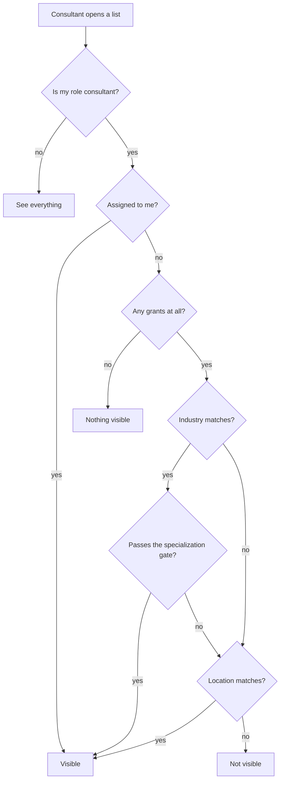
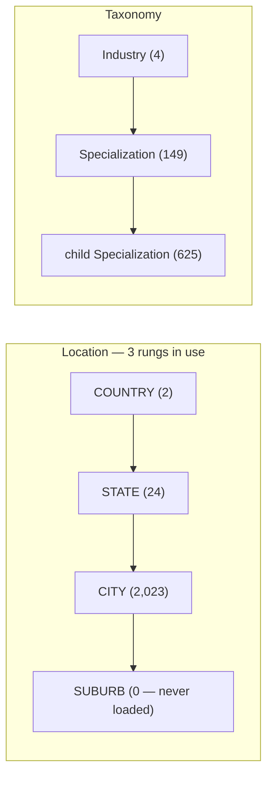
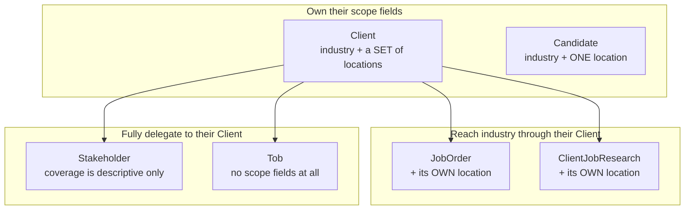
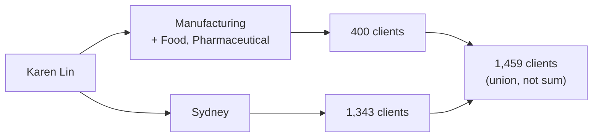
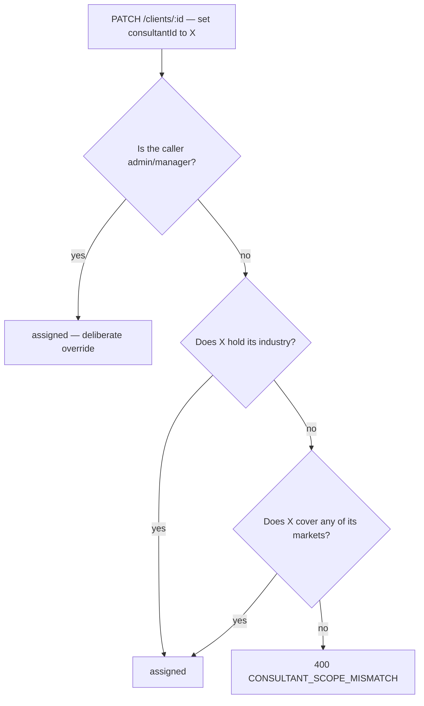
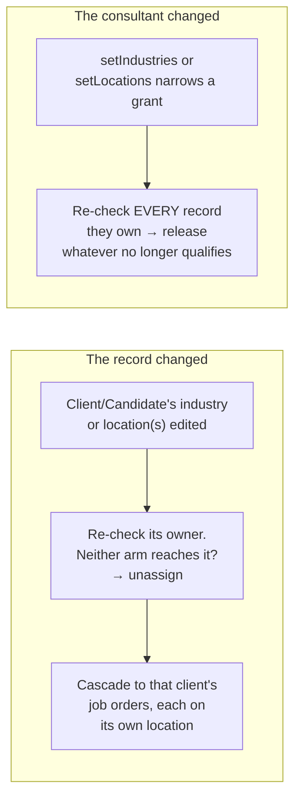

# Scope, explained

**Who can see what, and why.** This walks through the rules from a consultant's
point of view, with the real numbers from the seeded database.

For the implementer's reference — permission matrix, error codes, exact `where`
shapes — see [`rbac-roles.md`](./rbac-roles.md) §3. This document is the
explanation; that one is the specification. Code lives in
`apps/api/src/common/scope.ts`.

Every count below was measured against the dev database on 2026-08-03 by
running the real scope functions, not a reimplementation.

---

## Contents

1. [Two different questions](#1-two-different-questions)
2. [The rule](#2-the-rule)
3. [Grants cover everything beneath them](#3-grants-cover-everything-beneath-them)
4. [The hidden third gate: specialization](#4-the-hidden-third-gate-specialization)
5. [Who sees what, today](#5-who-sees-what-today)
6. [Per-entity rules](#6-per-entity-rules)
7. [Walkthroughs](#7-walkthroughs)
8. [Assignment](#8-assignment)
9. [What happens when things are deleted](#9-what-happens-when-things-are-deleted)
10. [Known gaps](#10-known-gaps)

---

## 1. Two different questions

These get confused constantly, so they're worth separating up front.

| | Comes from | Means | Set by |
|---|---|---|---|
| **Coverage** | grants on the consultant (`Manufacturing`, `Sydney`) | "this is my kind of work" | admin/manager, via `/consultants/:id/industries` etc. |
| **Ownership** | `consultantId` on the record itself | "this specific account is mine" | anyone with `:update` on that entity |

A consultant sees a record if **either** is true. Coverage is a standing rule;
ownership is one deliberate act on one row.

Only the **`consultant`** role is scoped at all. `admin`, `manager`, `finance`,
`researcher` and `viewer` see everything their permissions allow.

> **Zero grants means *not configured*, never *everything*.** Wildcards are
> materialised into concrete rows — `All Malaysia` is stored as one COUNTRY
> grant, never as an "unrestricted" flag. A consultant with no grants and no
> assignments sees nothing.

---

## 2. The rule

```
visible  =  assigned to me
         OR industry matches (and passes the specialization gate)
         OR location matches
```

The arms are **OR**-ed. This matters more than it sounds:

> **Whichever arm is broader decides everything, and the narrower one stops
> mattering.**

Joshua Fang covers Construction (914 candidates) and Sydney (3,071 candidates).
He sees 3,071. His industry grant adds nobody — every Construction candidate is
already in Sydney. Adding a grant can only ever widen, never narrow.



The ownership check sits **above** the no-grants short-circuit deliberately. Two
failures that prevents: being handed an account and still getting a 403 on it,
and watching one vanish the moment its industry is retagged.

---

## 3. Grants cover everything beneath them

Both hierarchies work the same way: **grant a node, get that node plus
everything under it.**



Grant `Australia` → you get all 24 states and all 2,023 cities under it.
Grant `Food` → you get `Food Bakery`, `Food Meat`, `Food Ready Made Meals`, …

Implemented with a denormalized `ancestorIds` column (self + every ancestor), so
the test is one indexed lookup rather than expanding a grant downward. A single
`COUNTRY:Australia` grant covers 1,502 nodes today and would grow with every
suburb ever loaded.

**Two things to know about the current data:**

- **Suburbs were never loaded** (0 rows). City is the finest grant available.
- **Specialization is only 2 levels deep.** There is no third rung.

**Linktal's desk labels are not nodes.** They're materialised at assignment time:

| Desk label | Stored as |
|---|---|
| `Brisbane GC QLD` | two CITY grants |
| `East Malaysia` | two STATE grants |
| `All Malaysia` | one COUNTRY grant |

---

## 4. The hidden third gate: specialization

Specialization is not a fourth arm. It's a **gate inside the industry arm**:

```
industry arm passes  =  industry matches
                     AND ( record has no specialization      ← free pass
                           OR its specialization is under one I hold )
```

Two consequences that surprise people:

**An untagged record is *more* visible, not less.** Leaving specialization blank
is a free pass through the gate. Tagging a record is what narrows who can see it.

**But the free pass only applies after industry already matched.** An untagged
Manufacturing candidate is visible to every Manufacturing consultant — not to
everyone.

```
Untagged Manufacturing candidate, seen by...

  Zhao Hao Teoh (Manufacturing)      Kim Chan (Construction)
  ────────────────────────────       ───────────────────────
  Manufacturing? ✅                   Manufacturing? ❌
  specialization? none → free pass    → industry arm fails, full stop
  → VISIBLE via industry              → visible only if she covers their city
```

### Why it hits clients 30× harder than candidates

How hard this gate bites is decided entirely by **tagging coverage** — not by
any deliberate setting:

| | Rows tagged with a specialization |
|---|---|
| Clients | **1,643 of 1,645** (99.9%) |
| Candidates | **205 of 3,960** (5.2%) |

Take Zhao Hao Teoh — Manufacturing, holding `Packaging` and `Food`:

| His clients | | | His candidates | |
|---|---|---|---|---|
| Manufacturing clients | 1,335 | | Manufacturing candidates | 2,157 |
| ├─ untagged (free pass) | 2 ✅ | | ├─ untagged (free pass) | 1,977 ✅ |
| ├─ tagged Packaging/Food | 397 ✅ | | ├─ tagged Packaging/Food | 147 ✅ |
| └─ tagged something else | **936 ❌** | | └─ tagged something else | **33 ❌** |

Same rule, same consultant, same industry. The filter isn't harsher on clients —
it just has vastly more to bite on.

> ⚠️ **This is an open decision.** Backfilling the missing candidate tags would
> narrow candidate lists sharply with no code change at all. Zhao could drop
> from 2,124 candidates to a few hundred overnight. Worth deciding deliberately
> rather than discovering.

---

## 5. Who sees what, today

### The grants

| Consultant | Industry | Specializations | Locations |
|---|---|---|---|
| Daniel Kee | Banking Financial Services | Bank, Asset Management, Insurance | 6 MY states + **Australia (country)** |
| Wong Yuen Xing | Banking Financial Services | Bank, Asset Management, Insurance | all 16 MY states + **Australia (country)** |
| Karen Lin | Manufacturing | Food, Pharmaceutical | Sydney |
| Eve Goh | Manufacturing | Packaging, Engineering Parts | Sydney |
| Zhao Hao Teoh | Manufacturing | Packaging, Food | Melbourne |
| Joshua Fang | Construction | Class 1, Class 2, Remedial, Fitout | Sydney |
| Kim Chan | Construction | Class 1, Class 2, Remedial, Fitout | Brisbane, Gold Coast |
| Woanru Lim | Equipment | EWP, Crane, Forklift, Excavators | Sydney, Melbourne, Brisbane, Gold Coast |

### What that resolves to

Totals in the system: **1,645** clients · **3,960** candidates · **6,451**
stakeholders · **10** job orders · **11** TOBs · **6** research rows.

| Consultant | Clients | Candidates | Contacts | Job orders | TOBs | Research |
|---|---|---|---|---|---|---|
| Daniel Kee | 1,610 | **3,960** | 6,263 | 10 | 9 | 6 |
| Wong Yuen Xing | 1,610 | **3,960** | 6,263 | 10 | 9 | 6 |
| Woanru Lim | 1,527 | 3,071 | 5,363 | 9 | 4 | 6 |
| Karen Lin | 1,459 | 3,071 | 5,057 | 8 | 4 | 5 |
| Eve Goh | 1,373 | 3,071 | 4,808 | 9 | 4 | 4 |
| Joshua Fang | 1,343 | 3,071 | 4,664 | 8 | 4 | 4 |
| Zhao Hao Teoh | 402 | 2,124 | 1,536 | 6 | 3 | 6 |
| Kim Chan | 401 | 890 | 1,533 | 1 | 2 | 0 |

### Which arm actually let them in — clients

| Consultant | via industry+spec | via location | **Total** |
|---|---|---|---|
| Daniel Kee | 83 | 1,527 | 1,610 |
| Wong Yuen Xing | 83 | 1,527 | 1,610 |
| Woanru Lim | **0** | 1,527 | 1,527 |
| Karen Lin | 400 | 1,343 | 1,459 |
| Eve Goh | 335 | 1,343 | 1,373 |
| Joshua Fang | 192 | 1,343 | 1,343 |
| Zhao Hao Teoh | 399 | **3** | 402 |
| Kim Chan | 192 | 186 | 401 |

Three things that table shows:

1. **Location dominates for almost everyone.** Six of eight get most of their
   list from geography.
2. **Woanru Lim's industry grant matches nothing.** `Equipment` has 0 clients and
   0 candidates in the whole database. Everything he sees is location.
3. **Zhao Hao Teoh is the mirror image** — Melbourne has 3 clients, so he's
   almost entirely industry.

> A client used to carry a fourth arm — reachable through a contact who
> covered the consultant's patch even when the company's own market didn't.
> It measured **0 for all 8 consultants** (every stakeholder's coverage was
> set equal to their client's own location, so it never reached anywhere the
> location arm didn't already) and has since been removed in favour of
> straightforward inheritance — see §6.

### A data artifact worth knowing

**Every Australian candidate in the source workbook is recorded as Sydney.**
Melbourne, Brisbane and Gold Coast have zero candidates. So today "Sydney" and
"all of Australia" mean the same thing for candidates, which is why four
consultants see the identical 3,071.

If that's a gap in the source data rather than reality, fixing it will change
these numbers a lot.

---

## 6. Per-entity rules

Four entities carry a `consultantId` and get the ownership arm. Stakeholder and
Tob don't — both delegate entirely to their parent Client instead.



| Entity | Ownership arm | Industry from | Location from |
|---|---|---|---|
| **Client** | ✅ | its own | its own market set |
| **Candidate** | ✅ | its own | its own single node |
| **JobOrder** | ✅ | its Client | its own node (nullable) |
| **ClientJobResearch** | ✅ | its Client | its own node (nullable) |
| **Stakeholder** | ❌ none | its Client | its Client's — visible exactly when its Client is |
| **Tob** | ❌ none | its Client | its Client's — visible exactly when its Client is |

### Stakeholder used to be an asymmetry — it isn't anymore

**Stakeholders used to match on their own coverage**, independent of their
employer: a Brisbane company's national account manager whose coverage
included Sydney was reachable by a Sydney-scoped consultant, on the theory
that's the person you'd actually ring about a Sydney role. Clients carried a
matching fourth arm as the counterpart — reachable through such a contact even
when the company's own market didn't match — so the two rules wouldn't
disagree with each other.

**Both are gone.** `stakeholderScope` is now `{ client: clientScope(user) }` —
identical to `tobScope` — so a stakeholder is visible exactly when its client
is, full stop. `coverage` remains on the row (who to call about which patch),
but it's descriptive data now, not a scope gate. This was a deliberate
simplification, not a bug fix: the old fourth arm measured **0 clients for all
8 consultants** the whole time (the importer set every stakeholder's coverage
equal to their client's own location, so it never reached anywhere the
location arm didn't already reach) — there was no real behavior it was
protecting once removed.

One side effect worth knowing: a consultant with **zero grants** who directly
owns a client (via assignment) can now see that client's stakeholders too.
Previously they couldn't — Stakeholder had no ownership arm of its own and the
old coverage-only check ignored `hasNoGrants`'s ownership short-circuit
entirely. That was the same class of bug §7's Karen Lin walkthrough describes
for `GET /clients` (an assigned account whose own list hid it) — this closes
the equivalent gap for stakeholders.

**TOBs still delegate entirely** — `tobScope` is `{ client: clientScope(user) }`,
unchanged. A TOB is a commercial document belonging to a company, so it's
visible exactly when that company is. Restating the arms here would let them
drift apart; Stakeholder now follows the identical pattern.

### Required vs. optional

| Entity | Industry | Location |
|---|---|---|
| Client | **required** | **required** — ≥1 `ClientLocation`, enforced in the app (a join table can't be required in the schema) |
| Candidate | **required** | **required** |
| JobOrder | via client | optional |
| ClientJobResearch | via client | optional |
| Stakeholder | via client | via client (its own `coverage` no longer scope-relevant) |

**A blank field makes a record harder to see, not easier** — the arm has nothing
to match on, so that route in closes. A job order with no location is reachable
only through its client's industry. (Blank *specialization* is the one exception,
§4.)

Every row is filled today: all 1,645 clients have a location, all 6,451 contacts
have coverage, all 10 job orders and 6 research rows have a location.

---

## 7. Walkthroughs

### Karen Lin's morning

Karen covers **Manufacturing** (`Food`, `Pharmaceutical`) and **Sydney**. She
owns 7 job orders.



She opens JO-0007, a role at **Bakers Maison Australia**.

| Question | Answer | Why |
|---|---|---|
| Can she see the job order? | ✅ | owned + client industry + Sydney |
| Can she see the client? | ✅ | Manufacturing + Sydney |
| Can she see its contacts? | ✅ | follows the client (Manufacturing + Sydney) |
| Can she see its TOB? | ✅ | follows the client |
| Can she see the submitted candidates? | ✅ | Sydney |

All 7 of her job orders sit at Manufacturing clients in Sydney — Air Liquide,
Cordina Chicken Farms, Regal Mushrooms, Premier Fresh Australia, Bakers Maison,
Newcold, Hakka. She matches every one on both arms.

> **This was broken until recently.** `GET /clients` used to AND on
> `consultantId = me`, which swallowed every other arm — so Karen saw **0
> clients** while owning 7 job orders at those very companies. She could open
> the job order and not reach the company it was for. Removing that one line is
> what produced the numbers in §5.

### Woanru Lim — an industry grant that matches nothing

`Equipment` has **0 clients and 0 candidates** in the entire database.

```
industry arm  →  0 records
location arm  →  Sydney, Melbourne, Brisbane, Gold Coast  →  1,527 clients
                                                             3,071 candidates
```

His whole working life runs through geography. Two knock-on effects:

- Removing his `Equipment` grant would change nothing he can see.
- Until the assignment guard was fixed, **he could not be assigned any account at
  all** — the guard checked industry only, and no client is in Equipment. He can
  now own any of the 1,527 clients in his cities (§8).

### Kim Chan — the narrowest desk

Construction, Brisbane + Gold Coast.

| Arm | Clients | Candidates |
|---|---|---|
| industry (Construction, all 4 specs) | 192 | 914 → **890** after the spec gate |
| location (Brisbane, Gold Coast) | 186 | **0** |
| **Total** | **401** | **890** |

Brisbane and the Gold Coast have no candidates at all, so her candidate list is
100% industry. Her 24 lost candidates are the only ones in the seed tagged with
a Construction specialization she doesn't hold.

### Daniel Kee — a country grant means everything

His `Australia` grant covers all 2,023 cities beneath it. Combined with his 6
Malaysian states:

```
Banking FS  →   889 candidates
Australia   → 3,071 candidates
             ─────────────────
union        → 3,960  = every candidate in the system
```

Including all 2,157 Manufacturing and 914 Construction candidates, none of which
are his industry. **Confirmed as intended** — but it's the reason a
country-level grant should be a deliberate choice, not a default.

---

## 8. Assignment

**Assignment must agree with visibility — for a consultant assigning it.** A
record can only be assigned to a consultant who would reach it anyway — the
same `industry OR location` test. Otherwise you'd hand someone an account
their own list then hides.



Locations compare through `ancestorIds`, so a COUNTRY grant qualifies its holder
for a CITY-tagged record, same as everywhere else.

**Admin and manager bypass the guard entirely.** Ownership is already the
top-priority arm in every scope function (`ownedBy` sits above the no-grants
short-circuit) — once assigned, the record is visible to its new owner
regardless of grants. The guard exists to stop a *consultant* handing
themselves or a peer an account that then silently vanishes from their own
list, not to stop admin/manager making a deliberate cross-scope exception
(e.g. a one-off account outside anyone's usual patch). Every consultant- or
researcher-initiated assignment still goes through the full check.

**Stakeholder coverage is deliberately excluded from this guard** — a client has
no contacts at the moment it's created, so the check would be unenforceable on
`create` and inconsistent with `update`. It's also moot now that a
stakeholder's visibility is fully inherited from its client (§6) — there's no
separate "ownership" of a contact to guard in the first place.

### Who can assign

Gated by permission, not role — anyone with `:update` on the entity:

| Role | Can assign? |
|---|---|
| admin · manager · **consultant** · **researcher** | ✅ |
| finance · viewer | ❌ (read only) |

One extra restriction: **a consultant can hand a client to someone else but
cannot unassign it entirely.** Sending `consultantId: null` gets a 403. Only
admin/manager can leave a client ownerless.

### Auto-clear — a stale assignment can never persist

Two triggers, both re-reading current state rather than acting on what changed:



Why it re-reads rather than acting on the removed ids: with two arms granting
ownership, **losing an industry no longer implies a record is stranded** — the
location arm may still cover it. The only correct test is to re-run the same
predicate against what the consultant currently holds.

Specializations never cascade. They only narrow the industry arm and never grant
on their own, so removing one strands nothing.

### Nothing is assigned yet

| Table | Assigned |
|---|---|
| Client | **0** of 1,645 |
| Candidate | **0** of 3,960 |
| ClientJobResearch | **0** of 6 |
| JobOrder | **10** of 10 |

The source workbook has an owner column on the job orders tab and nowhere else,
so the importer had nothing to copy from. Every number in §5 therefore comes
purely from coverage.

---

## 9. What happens when things are deleted

**Nothing is ever really deleted.** A delete stamps a `deletedAt` date; the row
stays and can be restored. Lists hide stamped rows automatically — **but only
when the row is looked up directly.**

That exception is where every leak comes from:

```
① Direct — you ask for candidates
   GET /candidates → candidate.findMany(...)
   The soft-delete layer intercepts and adds "deletedAt is null".
   A deleted candidate is GONE. ✅

② Indirect — you ask for a job order, and it brings the name along
   GET /job-orders/JO-0003 → jobOrder.findUnique({
     include: { submissions: { select: { candidate: { firstName } } } } })
                                                └─ the name rides in on this
   The layer only intercepts the OUTER call. It never looks inside an include.
   A deleted candidate is STILL THERE. ❌
```

The layer guards the front door, not the passengers. Some includes carry a
hand-written `deletedAt: null` because someone remembered to add it. A single
linked record (like `submission.candidate`) can't have one at all.

### Cascading is centralized now — Path A and Path B are the same path

This used to be two different stories: `ClientsService.remove` (and
`CandidatesService.remove`, `JobOrdersService.remove`) each hand-wrote their
own cascade, so anything that didn't call one of those three methods — a
script, the importer, another service, a raw Prisma call — orphaned every
child underneath.

**That's fixed at the root.** The cascade now lives in the Prisma extension
itself (`prisma.extensions.ts`, `CASCADE_MAP`), which intercepts every
`delete`/`deleteMany` on a soft-delete model regardless of who calls it. Client
→ JobOrder → CandidateSubmission → Placement, and Candidate → CandidateSubmission
→ Placement, all cascade automatically off a single soft-delete, walked
recursively. The three service methods are now one line each
(`return this.prisma.<model>.delete({ where: { id } })`) — the cascade isn't
their code anymore, it's a property of the delete itself.

| You delete | Cascades to | Still left behind |
|---|---|---|
| **Client** | stakeholders, job research, TOBs, job orders, and (through those) their submissions and placements | ⚠️ interviews (gap #3, §10) · ⚠️ cascaded placements don't reverse their side effects — see below |
| **Stakeholder** | nothing (it has no children) | ⚠️ client's "last contacted" date stays but its notes/type/by go blank |
| **Candidate** | their submissions, and (through those) their placements | ⚠️ interviews · ⚠️ cascaded placements don't reverse their side effects |
| **Job order** | its submissions, and (through those) their placements | ⚠️ interviews · ⚠️ cascaded placements don't reverse their side effects |
| **Placement**, deleted directly (`DELETE /placements/:id`) | nothing (no children) | *(nothing — see below)* |

**One distinction survives the fix: side effects vs. orphans.** The cascade
map only stamps `deletedAt` on children — it doesn't know that a Placement
carries business side effects (candidate → `PLACED`, job order `filledCount`,
client → `TRADED`). Reversing those is application logic that lives in
`PlacementsService.remove`, not in the generic cascade. So:

- Deleting a Placement **directly** (`DELETE /placements/:id`) reverses all
  three side effects (§ below).
- Deleting a **Client or Job Order** that has placements underneath cascades
  the placements to `deletedAt` (no orphan — they won't show up in a
  placements list) but does **not** touch the candidate's status, the job
  order's fill count, or the client's `TRADED` flag on any *other* affected
  record. A candidate placed through a job order that gets deleted this way
  stays `PLACED`.

That asymmetry (orphan-free, but side-effect-stale) is now the actual state,
in place of the old orphan problem. Worth deciding whether cascaded placement
deletes should also run the reversal — flagged as a new open item in §10.

### Reversing a Placement

Deleting a Placement directly reverses what `create` applied: the submission
and candidate drop back to `INTERVIEWING`/`WARM`, the job order's fill count
decrements (and its status reverts to `ACTIVE` if the placement had pushed it
to `PLACED`), and the client drops back to `WARM` — but only if this was its
one and only placement, leaving `TRADED` intact for a client with any other
live one. The placement's own `status` field is left untouched by delete —
deleting isn't a claim about *why* it didn't work out. A genuine "this fell
through" is a separate, deliberate `status: FAILED` transition via `update`.

### When is a deleted thing still visible?

| Condition | Hidden? |
|---|---|
| Row fetched directly by a list or by ID | ✅ hidden |
| Row's name pulled in through a parent's `include` | ❌ **still shows**, unless that include carries its own `deletedAt: null` |
| Any Prisma `delete`/`deleteMany` on a soft-delete model, from any call site | ✅ children cascade (the fix above) |
| A genuine raw SQL `DELETE` issued outside Prisma entirely | ❌ still bypasses everything — the extension only intercepts Prisma calls |
| Parent deleted without the cascade, child fetched from its own list | ❌ **child still shows** |

### Cases that cannot happen

**A job order with a deleted stakeholder.** `JobOrder` has no `stakeholderId` at
all — it links only to a Client.

### Nothing is deleted yet

0 soft-deleted clients, stakeholders or candidates. 0 orphans. 0 interviews. All
of the above is what *will* happen, not what has.

---

## 10. Known gaps

Open items, in rough order of consequence. Originally logged 2026-08-03;
updated 2026-08-08 as items got resolved.

| # | Gap | Status |
|---|---|---|
| 1 | **`submissions`, `interviews` and `placements` have no scoping at all.** Those three services never receive the logged-in user. Every consultant can list every submission, interview and placement in the system, including for clients and candidates they can't otherwise see. Only 4 submissions exist today, so nothing is exposed yet. Also the gate for whether a submission should grant implicit visibility into its candidate (§6-adjacent — a candidate isn't owned by a job order the way a stakeholder is owned by a client, so this can't just mirror that fix; leaning toward *not* granting implicit visibility, requiring the candidate to already be visible before a submission can link them). | Deferred |
| 2 | ~~The client delete cascade lives in a service method, so any other path orphans children.~~ **Fixed** — moved into the Prisma extension's `CASCADE_MAP` (§9), so it fires for any delete path, not just the three service methods. | Fixed |
| 3 | **Interviews are never cleaned up** by any cascade. 0 rows today, so nothing is broken yet. | Deferred |
| 4 | ~~Placement side effects are never reversed on delete.~~ **Fixed** for direct deletes (`DELETE /placements/:id`) — see §9. **Still open** for placements that get soft-deleted via a Client/JobOrder cascade (§9's "side effects vs. orphans" note) — those stamp `deletedAt` but don't reverse the candidate/job-order/client state. | Partially fixed |
| 5 | **The specialization gate is on and cuts client lists by up to two-thirds** (§4). Whether that's intended, and whether to backfill candidate tags, is undecided. Confirmed as working as designed — each entity gates on its own tag only, never a related entity's, so there's no cross-entity leak to worry about; the backfill question is a data decision, not a bug. | Open decision |
| 6 | **No client, candidate or research row has an owner.** Every number in §5 is pure coverage. | Open decision |
| 7 | **Every Australian candidate is recorded as Sydney** (§5). Likely a source-data gap — deliberately not being chased for now. | Ignored for now |
| 8 | **Cascaded placement deletes don't reverse side effects** (see gap #4's second half). Deciding whether a Client/JobOrder cascade should also run the same reversal `PlacementsService.remove` does, or whether that's acceptable as "the record's gone, its downstream status is a separate concern." | Open decision |

Confirmed as intended, for the record:

- Country-level grants for Daniel Kee and Wong Yuen Xing → both see all 3,960 candidates.
- Industry and location combine as **OR**, not AND.
- Clients reach consultants through industry/location, not through assignment alone.
- A candidate's own specialization gates their own visibility only — a
  client's specialization tag has no bearing on any candidate's visibility,
  and vice versa. No cross-entity matching exists, or is planned.
- Job orders stay single-owner (one `consultantId`, no many-to-many). What
  looks like "multiple consultants on one job order" is really independent
  consultants each owning different candidates submitted to it — see gap #1.

Resolved since 2026-08-03 (see §6, §8, §9 for the mechanics):

- Stakeholder visibility now fully inherits from its client — the old
  own-coverage asymmetry (and the client's matching fourth arm) is gone.
- Admin/manager can now deliberately assign a client, candidate, or job order
  outside a consultant's own grants — `assertConsultantCovers` accepts an
  `assignerRole` that bypasses `CONSULTANT_SCOPE_MISMATCH` for those two roles
  only.
- Delete cascades are centralized in the Prisma extension, closing the
  "any path that isn't the service method orphans children" hole.
- Deleting a Placement directly now reverses its side effects.

---

## Testing note

`candidateScope` once emitted `specializationId` — a column Candidate doesn't
have, since it holds a *set* through a join table. Prisma rejected the query
outright and `GET /candidates` returned a 500 for every consultant holding a
specialization grant, which is all eight of them.

**Two unit tests had encoded the broken shape.** Mocked Prisma delegates accept
any object, so shape assertions can prove the code emits what you expected —
never that Prisma accepts it.

**Probe scope changes against the real database, not only unit tests.**
