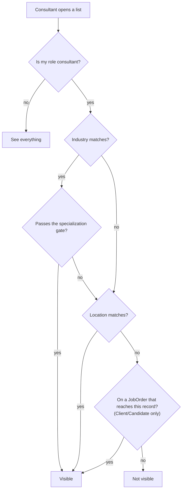
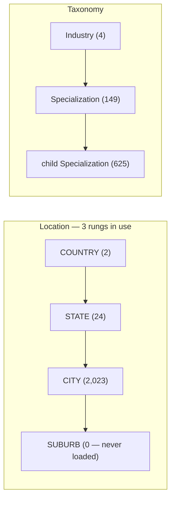
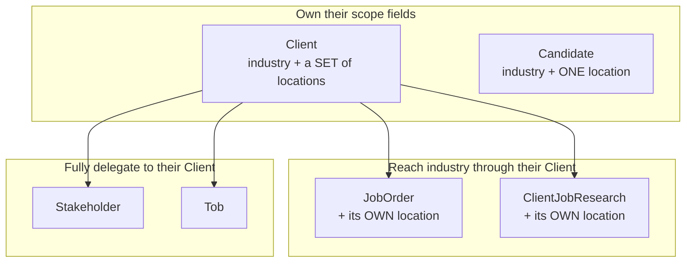
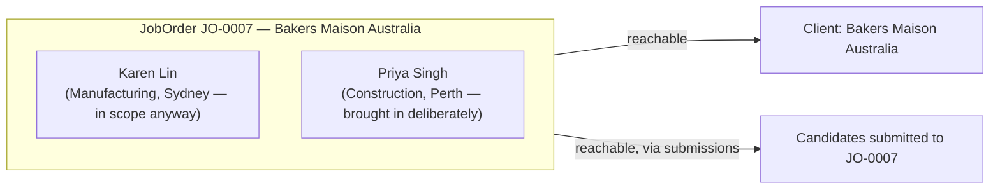

# Scope, explained

**Who can see what, and why.** This walks through the rules from a consultant's
point of view, with real numbers from the seeded database.

For the implementer's reference — permission matrix, error codes, exact `where`
shapes — see [`rbac-roles.md`](./rbac-roles.md) §3. This document is the
explanation; that one is the specification. Code lives in
`apps/api/src/common/scope.ts`.

Every count below was measured on 2026-08-12 by running the real scope
functions against the dev database, not a reimplementation.

---

## Contents

1. [The rule](#1-the-rule)
2. [Grants cover everything beneath them](#2-grants-cover-everything-beneath-them)
3. [The hidden third gate: specialization](#3-the-hidden-third-gate-specialization)
4. [Who sees what, today](#4-who-sees-what-today)
5. [Per-entity rules](#5-per-entity-rules)
6. [Job order consultant assignment](#6-job-order-consultant-assignment)
7. [What happens when things are deleted](#7-what-happens-when-things-are-deleted)
8. [Known gaps](#8-known-gaps)

---

## 1. The rule

```
visible  =  (industry match AND specialization match)  OR  (location match)
```

The arms are **OR**-ed. This matters more than it sounds:

> **Whichever arm is broader decides everything, and the narrower one stops
> mattering.**

Woanru Lim covers Equipment (0 clients, 0 candidates in the whole database) and
four cities (Sydney, Melbourne, Brisbane, Gold Coast). His industry grant adds
nobody — his entire visible list comes from geography. Adding a grant can only
ever widen, never narrow.

**This is a pure list filter — there is no gate.** `findAll` is the only place
any of this is enforced. A direct `findOne`/`update`/`remove` never checks
scope: a scoped consultant can open any record by id or a shared link
regardless of whether it matches their grants. There used to be a `403
OUT_OF_JOB_SCOPE` on single-record access and a `consultantId`-based ownership
arm that overrode everything — both are gone. Only the `consultant` role is
scoped at all; `admin`, `manager`, `finance`, `researcher` and `viewer` see
everything their permissions allow.



> **Zero grants means *not configured*, never *everything*.** Wildcards are
> materialised into concrete grant rows — `All Malaysia` is stored as one
> COUNTRY grant, never as an "unrestricted" flag. A consultant with no
> industry/location grants sees nothing on those two arms — `industryId: { in:
> [] } }` and `ancestorIds: { hasSome: [] } }` both evaluate to "matches
> nothing" in Postgres, so no special-cased short-circuit is needed in code
> anymore. The one arm that's exempt is job-order membership (§6) — that one
> never depended on grants in the first place.

---

## 2. Grants cover everything beneath them

Both hierarchies work the same way: **grant a node, get that node plus
everything under it.**



Grant `Australia` → you get all 24 states and all 2,023 cities under it.
Grant `Food` → you get `Food Bakery`, `Food Meat`, `Food Ready Made Meals`, …

Implemented with a denormalized `ancestorIds` column (self + every ancestor), so
the test is one indexed lookup rather than expanding a grant downward. A single
`COUNTRY:Australia` grant covers 1,502 nodes today and would grow with every
suburb ever loaded.

**Two things to know about the current data:**

- **Suburbs were never loaded** (0 rows). City is the finest grant available.
- **Specialization is only 2 levels deep.** There is no third rung.

**Linktal's desk labels are not nodes.** They're materialised at assignment time:

| Desk label | Stored as |
|---|---|
| `Brisbane GC QLD` | two CITY grants |
| `East Malaysia` | two STATE grants |
| `All Malaysia` | one COUNTRY grant |

---

## 3. The hidden third gate: specialization

Specialization is not a third arm. It's a **gate inside the industry arm**:

```
industry arm passes  =  industry matches
                     AND ( record has no specialization      ← free pass
                           OR its specialization is under one I hold )
```

Two consequences that surprise people:

**An untagged record is *more* visible, not less.** Leaving specialization blank
is a free pass through the gate. Tagging a record is what narrows who can see it.

**But the free pass only applies after industry already matched.** An untagged
Manufacturing candidate is visible to every Manufacturing consultant — not to
everyone.

```
Untagged Manufacturing candidate, seen by...

  Zhao Hao Teoh (Manufacturing)      Kim Chan (Construction)
  ────────────────────────────       ───────────────────────
  Manufacturing? ✅                   Manufacturing? ❌
  specialization? none → free pass    → industry arm fails, full stop
  → VISIBLE via industry              → visible only if she covers their city
```

### Why it hits clients much harder than candidates

How hard this gate bites is decided entirely by **tagging coverage** — not by
any deliberate setting. Historically (2026-08-03), 1,643 of 1,645 clients
carried a specialization versus only 205 of 3,960 candidates — the gate cuts
client lists hard and candidate lists barely, for no reason other than which
side of the workbook got tagged. Same rule, same consultant, same industry:
the filter isn't harsher on clients, it just has vastly more to bite on.

> ⚠️ **This is still an open decision.** Backfilling the missing candidate tags
> would narrow candidate lists sharply with no code change at all — worth
> deciding deliberately rather than discovering.

---

## 4. Who sees what, today

### The grants

| Consultant | Industry | Locations |
|---|---|---|
| Daniel Kee | Banking Financial Services | 6 MY states + **Australia (country)** |
| Wong Yuen Xing | Banking Financial Services | all 16 MY states + **Australia (country)** |
| Karen Lin | Manufacturing | Sydney |
| Eve Goh | Manufacturing | Sydney |
| Zhao Hao Teoh | Manufacturing | Melbourne |
| Joshua Fang | Construction | Sydney |
| Kim Chan | Construction | Brisbane, Gold Coast |
| Woanru Lim | Equipment | Sydney, Melbourne, Brisbane, Gold Coast |

(Specialization grants are omitted here — they only narrow the industry arm,
never widen it; see §3.)

### What that resolves to

Totals in the system today: **1,645** clients · **3,960** candidates · **10**
job orders.

| Consultant | Clients | Candidates | Job orders |
|---|---|---|---|
| Daniel Kee | 1,610 | **3,960** | 10 |
| Wong Yuen Xing | 1,610 | **3,960** | 10 |
| Woanru Lim | 1,527 | 3,071 | 9 |
| Karen Lin | 1,459 | 3,071 | 8 |
| Eve Goh | 1,373 | 3,071 | 9 |
| Joshua Fang | 1,343 | 3,071 | 8 |
| Zhao Hao Teoh | 400 | 2,124 | 6 |
| Kim Chan | 378 | 890 | 1 |

Two things worth knowing about these numbers:

1. **Location dominates for almost everyone.** The industry arm alone rarely
   beats a city/country grant — see Woanru Lim in §1, whose `Equipment` grant
   matches nothing at all.
2. **Job order counts now come from three sources**, OR-ed: the job order's
   client's industry, the job order's own location, and direct
   `JobOrderConsultant` membership (§6). The 10 job orders in the seed carry
   their original single-owner assignments, migrated one-for-one into
   `JobOrderConsultant` rows — so today's membership arm reproduces the old
   ownership numbers exactly, until someone deliberately adds a second
   consultant to one.

### A data artifact worth knowing

**Every Australian candidate in the source workbook is recorded as Sydney.**
Melbourne, Brisbane and Gold Coast have zero candidates. So today "Sydney" and
"all of Australia" mean the same thing for candidates, which is why several
consultants see the identical 3,071 or 3,960.

If that's a gap in the source data rather than reality, fixing it will change
these numbers a lot.

---

## 5. Per-entity rules

Three entities carry a job-order-membership arm — the deliberate way to reach
an out-of-scope record (§6). Stakeholder and Tob don't — both delegate entirely
to their parent Client instead.



| Entity | Industry from | Location from | Job-order-membership arm |
|---|---|---|---|
| **Client** | its own | its own market set | reachable via any live `JobOrder` this consultant is on |
| **Candidate** | its own | its own single node | reachable via a live submission to a `JobOrder` this consultant is on |
| **JobOrder** | its Client | its own node (nullable) | its own `JobOrderConsultant` membership |
| **ClientJobResearch** | its Client | its own node (nullable) | — (not job-order-scoped; see below) |
| **Stakeholder** | its Client | its Client's | — (delegates entirely to its Client) |
| **Tob** | its Client | its Client's | — (delegates entirely to its Client) |

### Stakeholder and Tob: full delegation

`stakeholderScope` is `{ client: clientScope(user) }` and `tobScope` is the
identical shape — a stakeholder or TOB is visible exactly when its client is,
full stop. `Stakeholder.coverage` is kept purely as descriptive routing data
(who to call about which patch), not a scope gate. Neither entity has an
ownership concept of its own to speak of — a contact belongs to a client, not
to a recruiter, and a TOB is a commercial document belonging to a company.

### ClientJobResearch: no membership arm, on purpose

`ClientJobResearch.consultantId` ("who conducted this research") is descriptive
metadata only — it never gated visibility even before this rework, and it
still doesn't now. Research is public market intelligence logged *before* a
job order necessarily exists, so there's no natural "member of this job order"
concept to borrow the way Client/Candidate now do.

### Required vs. optional

| Entity | Industry | Location |
|---|---|---|
| Client | **required** | **required** — ≥1 `ClientLocation`, enforced in the app (a join table can't be required in the schema) |
| Candidate | **required** | **required** |
| JobOrder | via client | optional |
| ClientJobResearch | via client | optional |
| Stakeholder | via client | via client |

**A blank field makes a record harder to see, not easier** — the arm has nothing
to match on, so that route in closes. A job order with no location is reachable
only through its client's industry (or its own `JobOrderConsultant` list).
(Blank *specialization* is the one exception, §3.)

---

## 6. Job order consultant assignment

**There is no more manual "assign a consultant to a client/candidate."**
`Client.consultantId` and `Candidate.consultantId` are gone from the schema
entirely — scope for those two entities is industry/location only, a pure
filter. The one deliberate way to reach an out-of-scope Client or Candidate is
to be added to a **Job Order**'s consultant list.



`JobOrder.consultantId` (a single nullable owner) has been replaced by
`JobOrderConsultant`, a many-to-many join table: **several consultants can work
the same job order concurrently.** Being on that list is a new OR-arm on
`clientScope` (via the job order's client) and `candidateScope` (via a
submission to that job order) — it doesn't unlock the client's *other* job
orders, candidates, or history, only what's actually attached to that specific
job order.

**No scope-mismatch guard applies.** Every other assignment path in the app
used to check "would this consultant reach the record anyway?" before allowing
an assignment — that guard doesn't exist here. Adding Priya Singh (Perth,
Construction) to a Manufacturing job order in Sydney is allowed outright. This
is the entire point: it's the sanctioned way to bring in help from outside
someone's usual patch, not an exception to be validated against.

### The endpoint

`PUT /job-orders/:id/consultants` — full-set-replace, `{ consultantIds:
string[] }`, mirroring `ConsultantsService.setIndustries`'s diff shape
(minimum add/remove set, each written as an individual top-level
`JobOrderConsultant` create/delete so the audit log sees and diffs every row).
Gated by `job_order:update` — the same permission that already covers editing
a job order's other fields, held by admin/manager/consultant/researcher.
`consultantIds` can also be seeded at creation time (`POST /job-orders`).

### Nothing auto-clears

Unlike the old ownership model (which used to silently unassign a consultant
whose industry/location no longer covered a record), `JobOrderConsultant`
membership is **immune to grant and industry drift** in both directions:

- Narrowing a consultant's own industry/location grants never touches their
  `JobOrderConsultant` rows.
- Re-linking a job order to a different client, or changing its location,
  never re-checks its members either.

That's deliberate — a membership grant that could evaporate on an unrelated
edit wouldn't be a reliable escape hatch. Once someone's added to a job order,
they stay on it until someone removes them.

### Frontend: no restriction on who's offered

The job order detail page and the "new job order" form both show the **full
active consultant roster** in the assignment picker — not filtered to
industry/location matches. When a picked consultant doesn't match the job
order's industry or location, the UI shows a **non-blocking warning** naming
them ("Jane Tan is outside this job order's industry and location — still fine
to add") rather than hiding them from the list or blocking the save. Reading
that warning requires the picker to resolve names and grants for consultants
who aren't the caller, which is why `consultant:read` and the three
`consultant_industry/specialization/location:read` permissions were widened
from admin/manager-only to include `consultant` and `researcher` — see
`rbac-roles.md` §2, footnote 3.

---

## 7. What happens when things are deleted

**Nothing is ever really deleted.** A delete stamps a `deletedAt` date; the row
stays and can be restored. Lists hide stamped rows automatically — **but only
when the row is looked up directly.**

That exception is where every leak comes from:

```
① Direct — you ask for candidates
   GET /candidates → candidate.findMany(...)
   The soft-delete layer intercepts and adds "deletedAt is null".
   A deleted candidate is GONE. ✅

② Indirect — you ask for a job order, and it brings the name along
   GET /job-orders/JO-0003 → jobOrder.findUnique({
     include: { submissions: { select: { candidate: { firstName } } } } })
                                                └─ the name rides in on this
   The layer only intercepts the OUTER call. It never looks inside an include.
   A deleted candidate is STILL THERE. ❌
```

The layer guards the front door, not the passengers. Some includes carry a
hand-written `deletedAt: null` because someone remembered to add it. A single
linked record (like `submission.candidate`) can't have one at all.

### Cascading is centralized — the Prisma extension owns it

The cascade lives in the Prisma extension itself (`prisma.extensions.ts`,
`CASCADE_MAP`), which intercepts every `delete`/`deleteMany` on a soft-delete
model regardless of who calls it — the API, a script, the importer, or a raw
Prisma call. Client → JobOrder → CandidateSubmission → Placement, and Candidate
→ CandidateSubmission → Placement, all cascade automatically off a single
soft-delete, walked recursively.

`JobOrderConsultant` is **not** part of this soft-delete cascade — it isn't a
soft-deletable model at all (no `deletedAt` column; it's a pure join table like
`ConsultantIndustry`). Its rows are hard-deleted via a plain FK
`onDelete: Cascade` whenever the `JobOrder` or `Consultant` row they reference
is *hard*-deleted. A JobOrder's ordinary soft-delete (the normal `DELETE
/job-orders/:id` path) leaves its `JobOrderConsultant` rows in place — they're
harmless once the parent job order itself is hidden, and restoring the job
order restores its consultant list along with it, with nothing extra to
reconcile.

| You delete | Cascades to | Still left behind |
|---|---|---|
| **Client** | stakeholders, job research, TOBs, job orders, and (through those) their submissions and placements | ⚠️ interviews (gap #1, §8) · ⚠️ cascaded placements don't reverse their side effects — see below |
| **Stakeholder** | nothing (it has no children) | ⚠️ client's "last contacted" date stays but its notes/type/by go blank |
| **Candidate** | their submissions, and (through those) their placements | ⚠️ interviews · ⚠️ cascaded placements don't reverse their side effects |
| **Job order** | its submissions, and (through those) their placements | ⚠️ interviews · ⚠️ cascaded placements don't reverse their side effects |
| **Placement**, deleted directly (`DELETE /placements/:id`) | nothing (no children) | *(nothing — see below)* |

**One distinction survives the fix: side effects vs. orphans.** The cascade
map only stamps `deletedAt` on children — it doesn't know that a Placement
carries business side effects (candidate → `PLACED`, job order `filledCount`,
client → `TRADED`). Reversing those is application logic that lives in
`PlacementsService.remove`, not in the generic cascade. So:

- Deleting a Placement **directly** (`DELETE /placements/:id`) reverses all
  three side effects (§ below).
- Deleting a **Client or Job Order** that has placements underneath cascades
  the placements to `deletedAt` (no orphan — they won't show up in a
  placements list) but does **not** touch the candidate's status, the job
  order's fill count, or the client's `TRADED` flag on any *other* affected
  record. A candidate placed through a job order that gets deleted this way
  stays `PLACED`.

### Reversing a Placement

Deleting a Placement directly reverses what `create` applied: the submission
and candidate drop back to `INTERVIEWING`/`WARM`, the job order's fill count
decrements (and its status reverts to `ACTIVE` if the placement had pushed it
to `PLACED`), and the client drops back to `WARM` — but only if this was its
one and only placement, leaving `TRADED` intact for a client with any other
live one. The placement's own `status` field is left untouched by delete —
deleting isn't a claim about *why* it didn't work out. A genuine "this fell
through" is a separate, deliberate `status: FAILED` transition via `update`.

### When is a deleted thing still visible?

| Condition | Hidden? |
|---|---|
| Row fetched directly by a list or by ID | ✅ hidden |
| Row's name pulled in through a parent's `include` | ❌ **still shows**, unless that include carries its own `deletedAt: null` |
| Any Prisma `delete`/`deleteMany` on a soft-delete model, from any call site | ✅ children cascade |
| A genuine raw SQL `DELETE` issued outside Prisma entirely | ❌ still bypasses everything — the extension only intercepts Prisma calls |
| Parent deleted without the cascade, child fetched from its own list | ❌ **child still shows** |

### Cases that cannot happen

**A job order with a deleted stakeholder.** `JobOrder` has no `stakeholderId` at
all — it links only to a Client.

---

## 8. Known gaps

Open items, in rough order of consequence.

| # | Gap | Status |
|---|---|---|
| 1 | **`submissions`, `interviews` and `placements` have no scoping at all.** Those three services never receive the logged-in user. Every consultant can list every submission, interview and placement in the system, including for clients and candidates they can't otherwise see. | Deferred |
| 2 | **Interviews are never cleaned up** by any cascade. | Deferred |
| 3 | **Cascaded placement deletes don't reverse side effects.** Fixed for direct deletes (`DELETE /placements/:id`) — see §7. Still open for placements that get soft-deleted via a Client/JobOrder cascade — those stamp `deletedAt` but don't reverse the candidate/job-order/client state. | Partially fixed |
| 4 | **The specialization gate is on and cuts client lists hard** (§3). Whether to backfill candidate tags is undecided — each entity gates on its own tag only, no cross-entity leak. | Open decision |
| 5 | **No Client or Candidate has an owner anymore, by design** — there is no such concept left. Every client/candidate list is pure industry/location filtering, plus whatever job-order membership adds. This used to be listed as a gap ("nothing is assigned yet"); it no longer applies — there's nothing to assign. | Resolved by design |
| 6 | **Every Australian candidate is recorded as Sydney** (§4). Likely a source-data gap — deliberately not being chased for now. | Ignored for now |

Confirmed as intended, for the record:

- Country-level grants for Daniel Kee and Wong Yuen Xing → both see all 3,960 candidates.
- Industry and location combine as **OR**, not AND.
- A candidate's own specialization gates their own visibility only — a
  client's specialization tag has no bearing on any candidate's visibility,
  and vice versa. No cross-entity matching exists, or is planned.
- Several consultants can now genuinely work the same job order concurrently
  (`JobOrderConsultant`) — this replaces the old workaround of independent
  consultants each owning different candidates submitted to the same job
  order.
- Scope never gates a direct fetch by id, for any entity — only `findAll`
  filters. This was a deliberate simplification: the old `403
  OUT_OF_JOB_SCOPE` gate added complexity without adding real protection once
  job-order membership existed as a sanctioned way to be handed an
  out-of-scope record anyway.

---

## Testing note

`candidateScope` once emitted `specializationId` — a column Candidate doesn't
have, since it holds a *set* through a join table. Prisma rejected the query
outright and `GET /candidates` returned a 500 for every consultant holding a
specialization grant, which is all eight of them.

**Two unit tests had encoded the broken shape.** Mocked Prisma delegates accept
any object, so shape assertions can prove the code emits what you expected —
never that Prisma accepts it.

**Probe scope changes against the real database, not only unit tests.**
